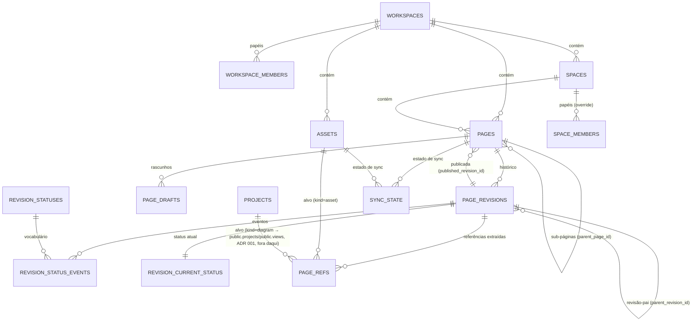

# ADR 003 — Armazenamento e versionamento

| Campo       | Valor                                                                                                                    |
| :---------- | :------------------------------------------------------------------------------------------------------------------------ |
| Status      | **Aceito** em 2026-09-19, junto com o ADR 002, do qual depende estruturalmente                                           |
| Data        | 2026-09-18                                                                                                                |
| Camada      | Armazenamento e versionamento (revisões, espaços, árvore de páginas, assets, integridade referencial)                    |
| Depende de  | Arquitetura base; ADR 001 (motor de diagrama); ADR 002 (formato de conteúdo, Proposto)                                    |
| Decide      | Modelo de revisões, o que se persiste, rascunhos e concorrência, espaços/hierarquia/slugs, tabelas derivadas, assets, integridade página↔diagrama, multi-inquilino/RLS |
| Não decide  | Máquina de estados do fluxo editorial e comentários ancorados (ADR 004), editor (ADR 005), renderização (ADR 007), ranking de busca (ADR 009), exportação e lógica de sync (ADR 010) |
| Reversível? | Parcialmente — ver seção 9                                                                                                |

## 1. Decisão

**Postgres puro no Supabase. Cada revisão de página é uma linha imutável e append-only em `page_revisions`, com o texto canônico DokMD completo (não delta) — nunca um diff armazenado. O status editorial não mora na revisão: é um log de eventos append-only à parte (`revision_status_events`), projetado numa tabela de leitura rápida (`revision_current_status`). `pages.published_revision_id` aponta para a revisão publicada; publicar é inserir um evento, não editar a revisão. Rascunhos vivem numa tabela mutável separada (`page_drafts`, uma linha por autor por página) que só produz uma revisão imutável quando o autor submete. Referências (links, assets, diagramas) extraídas do conteúdo (`collectRefs`, do ADR 002) alimentam uma tabela derivada (`page_refs`) que serve de backlinks, grafo e checagem de integridade — não há FK direto do conteúdo para o que ele referencia, porque a referência mora dentro do texto, não numa coluna.**

Por quê, em uma linha cada:

- **Snapshot completo, não delta**: o ADR 002 já decidiu que o texto canônico é a fonte de verdade e cabe em uma coluna `text`; computar/armazenar deltas adicionaria complexidade (reconstrução, corrupção acumulada) para economizar um recurso que é barato no Postgres. Diff é uma operação de leitura (`diff(a.content_dokmd, b.content_dokmd)`), nunca de escrita.
- **Status fora da revisão**: se o status morasse em `page_revisions`, ou a revisão deixaria de ser imutável (contradizendo A-02), ou cada mudança de estado exigiria uma revisão nova idêntica só para trocar um enum (poluindo o histórico de conteúdo com ruído editorial). Separar os dois deixa `page_revisions` genuinely append-only e dá ao ADR 004 um vocabulário de estados que cresce só com `INSERT`, nunca com migração de schema (cumpre A-01 ao pé da letra).
- **Um rascunho por autor por página**: cobre o caso real do produto (edição solo, aprovação depois) sem o custo de um modelo de branches nomeados que ninguém pediu. Concorrência entre dois autores é detectada, não silenciosamente resolvida — ver seção sobre `based_on_revision_id`.
- **`page_refs` sem FK direto**: uma referência a diagrama vive dentro de uma URI de texto (`dok:diagram/<uuid>`), não numa coluna relacional; e o alvo pode ser uma tabela que este ADR não possui (diagramas são do ADR 001). Um índice derivado, recalculado a cada save, é o único jeito de ter backlinks e checagem de integridade sem acoplar o parser ao schema de outra camada.
- **RLS em todas as tabelas de conteúdo, acesso mediado por server functions**: nenhuma tabela é exposta para escrita direta do cliente. RLS é defesa em profundidade (protege contra bug de autorização na server function, e habilita Realtime com segurança no futuro — ver seção 7.4), não o único portão.

> [!IMPORTANT]
> Revisado contra os tipos reais do Supabase (`supabase-types-dokdraw.ts`): `public.workspaces(id, name, owner_id)` existe, mas **não existe** tabela de papel por workspace. O que existe é `public.user_roles(user_id, role: "admin"|"member")` — global, sem `workspace_id` — e `public.invites(email, status, invited_by, ...)` — também sem `workspace_id`. Ou seja, hoje só `owner_id` distingue quem manda em um workspace; não há como um segundo usuário ter um papel *naquele* workspace especificamente. Isso não é compatível com "RLS por espaço e por papel" (pergunta 8 do prompt). Este ADR passa a **criar** `content.workspace_members`, em vez de assumi-la como pré-existente — ver seção 6.2. Fica um risco aberto genuíno: como alguém entra em `workspace_members` (o fluxo de convite atual não referencia workspace nenhum) é decisão de fora daqui — ver seção 10.

## 2. Contexto e entradas recebidas

Do LEDGER.md (Aceito):

- **ADR 001** — diagramas em tabelas Supabase, referenciados por **id estável, nunca por título**; premissa para cá: a renderização exibe uma **view** de diagrama em modo leitura dentro de uma página.

Do ADR 002 (Proposto, recomendação inicial que este ADR assume):

- Texto canônico DokMD é a **fonte de verdade**; AST (mdast) e índices são **derivados**. Isso decide sozinho boa parte da pergunta 2 deste ADR: **guarda-se o texto**, não a AST em JSONB como estrutura primária — a AST pode ser cacheada, mas não é o que se persiste como fato.
- Frontmatter obrigatório: `dok`, `id`, `title`; **sem** data, slug, status ou hierarquia — "isso é do banco" (citação direta da decisão do ADR 002). Ou seja, o ADR 002 já delega a este ADR exatamente as perguntas 4, 7 e 11 do prompt.
- Referências por URI `dok:page/<uuid>`, `dok:asset/<uuid>`, `dok:diagram/<uuid>[?view=<uuid>]`; `collectRefs(ast)` já está especificado e devolve `{kind, id, view?, rev?, anchor?, position}` — este ADR só precisa de uma tabela para guardar a saída dessa função.
- `extractText(ast)` já define o que é indexável, por bloco — a busca (ADR 009) consome isso; este ADR só precisa garantir que dá para rodar `extractText` sobre uma revisão publicada e, separadamente, sobre o rascunho do próprio autor.

Do produto: Wiki é o produto principal; export para Starlight, vault Obsidian, `.md` universal e `.docx`; Google Drive é espelho periódico de mão única (nunca fonte de verdade); pipeline de aprovação (rascunho → revisão → aprovação → publicação) é requisito futuro explícito — e este ADR precisa comportá-lo **sem migração**.

Da arquitetura base: Supabase multi-inquilino; TanStack Start com server functions (logo, o acesso a estas tabelas é majoritariamente server-side, não client direto contra PostgREST); nenhuma dependência nova sem justificativa; sempre a versão mais recente estável, com link.

## 3. Critérios

### Eliminatórios (do prompt, literais)

| ID   | Critério                                                                 | Como verifico aqui                                                                                     |
| :--- | :------------------------------------------------------------------------ | :-------------------------------------------------------------------------------------------------------- |
| A-01 | Suporta os estados do fluxo editorial sem mudar o schema das revisões    | Novo estado do ADR 004 = `INSERT` em `revision_statuses` + `revision_status_events`; zero `ALTER TABLE` em `page_revisions` |
| A-02 | Toda revisão publicada é reconstituível byte a byte                     | `page_revisions.content_dokmd` é o byte exato gravado no save; trigger bloqueia `UPDATE`/`DELETE` na tabela, então nem um bug de servidor consegue alterar uma revisão depois de criada |
| A-03 | RLS aplicável em todas as tabelas de conteúdo                            | Toda tabela de conteúdo (não as de referência/lookup) tem `ENABLE ROW LEVEL SECURITY` + política; literal — se o candidato não guarda conteúdo em tabela, falha aqui por definição |
| A-04 | Funciona no Supabase gerenciado, sem extensão que o plano não ofereça    | `gen_random_uuid()` é função core do Postgres 13+ (sem extensão); nenhum outro recurso fora do core é usado |

### Compatibilidade para trás (Regra 2 do prompt)

| ID   | Critério                                                                 |
| :--- | :------------------------------------------------------------------------ |
| B-01 | Compatível com a arquitetura base                                        |
| B-02 | Compatível com a restrição do ADR 002: texto canônico é fonte de verdade, AST é derivada |
| B-03 | Compatível com o ADR 001: diagramas referenciados por id estável, nunca por título |

### Importantes (peso, 0–3 por candidata sobrevivente)

| ID  | Critério                                                                 | Peso | Por que, neste projeto                                                      |
| :-- | :------------------------------------------------------------------------ | ---: | :----------------------------------------------------------------------------- |
| I-1 | Custo de implementação e operação                                        |    5 | Time pequeno, projeto Lovable                                                 |
| I-2 | Performance de leitura (árvore de páginas, histórico, backlinks)         |    3 | Sidebar e histórico são acessados a toda hora                                 |
| I-3 | Simplicidade operacional (backup, disaster recovery, consistência)       |    3 | Um sistema a menos para operar é um sistema a menos para quebrar              |
| I-4 | Não duplica infraestrutura de mirror sem pedido do produto               |    2 | O único mirror pedido é Google Drive, e é de mão única e periódico            |
| I-5 | Auditoria e consulta ad hoc via SQL                                      |    2 | Suporte, investigação de bug, relatório interno                               |
| I-6 | Não fecha a porta para colaboração em tempo real                        |    1 | Requisito explícito do prompt ("não pode impedir colaboração mais adiante")   |

## 4. Candidatas

| ID | Candidata                                                             | Peças                                                                                   |
| :- | :---------------------------------------------------------------------- | :---------------------------------------------------------------------------------------- |
| A  | **Postgres puro** — revisões append-only, snapshot completo             | Só tabelas Postgres nativas do Supabase; nenhum pacote novo                              |
| B  | Git como store — cada página é um arquivo, revisão = commit             | [isomorphic-git 1.32.1](https://npmjs.com/package/isomorphic-git) MIT — pura JS, sem binário nativo |
| C  | Híbrido — Postgres (igual A) + espelho periódico de mão única para um repositório git | A + a mesma peça de B, usada só para o espelho                                            |
| D  | CRDT (Yjs) como armazenamento primário, com snapshot em Markdown        | (avaliada conceitualmente; não chega a candidata de pacote — ver eliminação)              |

## 5. Avaliação

### 5.1 Eliminatórios

| Requisito                          | A (Postgres) | B (Git)                                                                 | C (Híbrido)   | D (CRDT primário) |
| :---------------------------------- | :----------- | :------------------------------------------------------------------------ | :------------- | :------------------ |
| A-01 estados sem mudar schema       | N            | C — estados viram branches/tags/mensagens de commit; orquestração é 100% aplicação | N (herda de A) | N                    |
| A-02 reconstituível byte a byte     | N            | N — git é nativamente snapshot imutável por commit                        | N              | N¹                   |
| A-03 RLS em tabela de conteúdo      | N            | **X** — não existe "tabela de conteúdo": o conteúdo mora em blobs de arquivo; RLS do Supabase não tem granularidade de commit/arquivo dentro de um blob | N (herda de A) | N                    |
| A-04 roda no Supabase gerenciado    | N            | C — isomorphic-git é JS puro (não viola "sem binário nativo"), mas não há hospedagem git gerenciada: o repositório vira blobs no Storage, reimplementados à mão | N              | N                    |
| B-01 compatível com base            | N            | C (ver A-01/A-04)                                                        | N              | N                    |
| B-02 texto canônico é fonte de verdade (ADR 002) | N | N                                                                          | N              | **X²**               |
| B-03 diagrama por id estável (ADR 001) | N         | N                                                                          | N              | N                    |

1. Reconstituível sim, **mas** só porque a implementação prática de D acaba armazenando snapshots de texto — o que já é a candidata A com um rótulo diferente. Isso é o próprio argumento da eliminação abaixo.
2. Se o log de updates do Yjs (binário) é o que se persiste como fato e o Markdown é "snapshot derivado dele", isso inverte a restrição do ADR 002 (texto canônico é a fonte de verdade; o resto é derivado). Conflito direto com a Regra 2 de compatibilidade do prompt — **elimina**, sem proposta de reabertura do ADR 002 (não há justificativa de produto para reabrir).

**Eliminadas: B** (X em A-03 — RLS não se aplica a um blob de arquivo do jeito que se aplica a uma linha de tabela; é exatamente o requisito A-03 pedindo o que git não tem) **e D** (X em B-02 — conflita com uma restrição explícita do ADR 002 que este ADR não está propondo reabrir).

C sobrevive aos eliminatórios porque seu armazenamento primário é idêntico ao de A — o espelho git é só uma cópia de leitura, fora do caminho crítico.

### 5.2 Ponderação (A vs. C)

| Critério (peso)                             | A (Postgres puro) | C (Híbrido + espelho git) |
| :-------------------------------------------- | -----------------: | ---------------------------: |
| I-1 Custo (5)                                 |                  3 |                            1 |
| I-2 Performance de leitura (3)                |                  3 |                            3 |
| I-3 Simplicidade operacional (3)              |                  3 |                            1 |
| I-4 Não duplica infra sem pedido (2)          |                  3 |                            1 |
| I-5 Auditoria via SQL (2)                     |                  3 |                            2 |
| I-6 Não fecha porta p/ tempo real (1)         |                  3 |                            3 |
| **Total (máx. 51)**                           |             **51** |                       **26** |

C perde principalmente em I-1 e I-3: manter um segundo sistema (repositório git, job de export, resolução de conflito do próprio espelho) sem que nenhum requisito de produto peça um mirror em git — o único mirror pedido é Google Drive, já coberto por fora deste ADR (ADR 010). **Decisão: A.**

## 6. Modelo de dados

### 6.1 Visão geral (respostas às 10 perguntas do prompt)

| #  | Pergunta                     | Resposta                                                                                                                   |
| :- | :----------------------------- | :----------------------------------------------------------------------------------------------------------------------------- |
| 1  | Modelo de revisões            | Append-only, snapshot completo por revisão (não delta, não event sourcing do conteúdo). Editorial **é** event sourcing, mas separado do conteúdo |
| 2  | O que se guarda                | Texto canônico (`content_dokmd`), conforme restrição do ADR 002. `frontmatter` e `ast` são caches JSONB derivados, regeneráveis |
| 3  | Rascunhos                      | Um por autor por página (`page_drafts`, PK composta). Concorrência entre autores detectada via `based_on_revision_id`, não resolvida automaticamente |
| 4  | Espaços, árvore, slugs         | `spaces` flat por workspace; `pages` em árvore (`parent_page_id`) dentro de um espaço; `slug` é só cosmético (URL bonita), unicidade escopada ao nível da árvore; identidade real é `id` (uuid) — renomear nunca quebra `dok:page/<uuid>` |
| 5  | Tabelas derivadas               | `page_refs` (backlinks/grafo/integridade) recalculada a cada revisão salva; `revision_current_status` recalculada a cada evento; índice de busca é do ADR 009, fora daqui |
| 6  | Assets                          | Bucket privado no Supabase Storage; URL assinada gerada por server function; deduplicados por checksum; **imutáveis** — trocar a imagem cria um novo asset (novo id), nunca sobrescreve o existente |
| 7  | Página ↔ diagrama               | Referência por URI de texto, sem FK de banco (diagrama é tabela de outro ADR); integridade via `page_refs` — ver seção 6.6 |
| 8  | Multi-inquilino                 | `workspace_id` denormalizado nas tabelas quentes; RLS por papel efetivo no espaço; soft delete + lixeira + retenção configurável |
| 9  | Concorrência                    | Bloqueio otimista: `page_drafts.version` para autosave; `based_on_revision_id` para divergência entre autores no submit |
| 10 | Alternativas                    | Seção 4/5 acima                                                                                                                |

### 6.2 DDL proposto

> [!NOTE]
> Marcado como **proposta**, não como migração final. Assume o schema `content` dedicado, exposto no PostgREST com `GRANT` para `authenticated` e protegido pela RLS da seção 6.3 (correção de 2026-09-21, aprovada em `DDP-154`: o app não tem conexão direta ao Postgres, todo acesso passa pelo `supabase-js`), e a tabela externa `public.workspaces(id, name, owner_id)` — confirmada em `supabase-types-dokdraw.ts` — como pré-existente. `content.workspace_members` **não** é pré-existente: este ADR a cria, porque `public.user_roles` é global (sem `workspace_id`) e não serve para RLS por workspace.

```sql
create schema if not exists content;

-- ============================================================
-- 0. Papel por workspace (não existe hoje; public.user_roles é
--    global, sem workspace_id, e não serve para RLS por workspace)
-- ============================================================

create table content.workspace_members (
  workspace_id uuid not null references public.workspaces(id) on delete cascade,
  user_id      uuid not null references auth.users(id),
  role         text not null check (role in ('owner', 'admin', 'editor', 'viewer')),
  created_at   timestamptz not null default now(),
  primary key (workspace_id, user_id)
);

-- todo workspace nasce com o owner_id já como membro 'owner';
-- sem isso, o próprio criador do workspace ficaria de fora de content.effective_role
create or replace function content.seed_workspace_owner()
returns trigger language plpgsql as $$
begin
  insert into content.workspace_members (workspace_id, user_id, role)
  values (new.id, new.owner_id, 'owner')
  on conflict (workspace_id, user_id) do nothing;
  return new;
end;
$$;

create trigger workspaces_seed_owner
  after insert on public.workspaces
  for each row execute function content.seed_workspace_owner();

-- ============================================================
-- 1. Espaços e árvore de páginas
-- ============================================================

create table content.spaces (
  id           uuid primary key default gen_random_uuid(),
  workspace_id uuid not null references public.workspaces(id) on delete cascade,
  name         text not null,
  slug         text not null,
  icon         text,
  position     numeric not null default 0,
  created_by   uuid not null references auth.users(id),
  created_at   timestamptz not null default now(),
  deleted_at   timestamptz,
  unique (workspace_id, slug)
);

create table content.space_members (
  space_id uuid not null references content.spaces(id) on delete cascade,
  user_id  uuid not null references auth.users(id),
  role     text not null check (role in ('admin', 'editor', 'reviewer', 'viewer')),
  primary key (space_id, user_id)
);

create table content.pages (
  id                     uuid primary key default gen_random_uuid(),
  workspace_id           uuid not null references public.workspaces(id) on delete cascade,
  space_id               uuid not null references content.spaces(id) on delete cascade,
  parent_page_id         uuid references content.pages(id) on delete cascade,
  slug                   text not null,
  title                  text not null default 'Sem título', -- cache; fonte de verdade é frontmatter.title da revisão publicada
  position               numeric not null default 0,
  published_revision_id  uuid, -- FK adicionada após criar page_revisions (dependência circular)
  created_by             uuid not null references auth.users(id),
  created_at             timestamptz not null default now(),
  updated_at             timestamptz not null default now(),
  deleted_at             timestamptz,
  unique (space_id, parent_page_id, slug)
);

-- ============================================================
-- 2. Revisões (append-only) e workflow (event-sourced, à parte)
-- ============================================================

create table content.page_revisions (
  id                  uuid primary key default gen_random_uuid(),
  workspace_id        uuid not null references public.workspaces(id) on delete cascade,
  page_id             uuid not null references content.pages(id) on delete cascade,
  parent_revision_id  uuid references content.page_revisions(id),
  dok_version         smallint not null check (dok_version >= 1),
  content_dokmd       text not null,
  content_hash        text not null, -- sha256 hex de content_dokmd
  frontmatter         jsonb not null, -- cache de leitura; sempre derivável de content_dokmd
  ast                 jsonb, -- cache opcional de mdast; regenerável, pode ficar null
  author_id           uuid not null references auth.users(id),
  created_at          timestamptz not null default now()
);

alter table content.pages
  add constraint pages_published_revision_fk
  foreign key (published_revision_id) references content.page_revisions(id);

create index page_revisions_by_page on content.page_revisions (page_id, created_at desc);
create index page_revisions_by_hash on content.page_revisions (page_id, content_hash); -- detectar save sem mudança real

create table content.revision_statuses (
  code        text primary key,
  label       text not null,
  is_terminal boolean not null default false
);

insert into content.revision_statuses (code, label, is_terminal) values
  ('submitted',          'Enviada para revisão', false),
  ('in_review',          'Em revisão',            false),
  ('changes_requested',  'Mudanças solicitadas',  false),
  ('approved',           'Aprovada',              false),
  ('published',          'Publicada',             true),
  ('rejected',           'Rejeitada',             true),
  ('superseded',         'Substituída',           true)
on conflict (code) do nothing;
-- ADR 004 adiciona/edita linhas aqui livremente; page_revisions nunca muda por causa disso

create table content.revision_status_events (
  id           bigint generated always as identity primary key,
  revision_id  uuid not null references content.page_revisions(id) on delete cascade,
  from_status  text references content.revision_statuses(code),
  to_status    text not null references content.revision_statuses(code),
  actor_id     uuid not null references auth.users(id),
  comment      text,
  created_at   timestamptz not null default now()
);

create table content.revision_current_status (
  revision_id  uuid primary key references content.page_revisions(id) on delete cascade,
  status_code  text not null references content.revision_statuses(code),
  updated_at   timestamptz not null default now()
);

-- projeta o evento na tabela de leitura rápida e, se for publicação, atualiza o ponteiro da página
create or replace function content.apply_revision_status_event()
returns trigger language plpgsql as $$
begin
  insert into content.revision_current_status (revision_id, status_code, updated_at)
  values (new.revision_id, new.to_status, new.created_at)
  on conflict (revision_id) do update
    set status_code = excluded.status_code, updated_at = excluded.updated_at;

  if new.to_status = 'published' then
    update content.pages p
       set published_revision_id = new.revision_id,
           title      = coalesce(r.frontmatter ->> 'title', p.title),
           updated_at = new.created_at
      from content.page_revisions r
     where r.id = new.revision_id
       and p.id = r.page_id;
  end if;

  return new;
end;
$$;

create trigger revision_status_events_apply
  after insert on content.revision_status_events
  for each row execute function content.apply_revision_status_event();

-- imutabilidade garantida no banco, não só por convenção de aplicação
create or replace function content.forbid_mutation()
returns trigger language plpgsql as $$
begin
  raise exception 'tabela append-only: % não é permitido em % (id=%)', TG_OP, TG_TABLE_NAME, old.id;
end;
$$;

create trigger page_revisions_immutable
  before update or delete on content.page_revisions
  for each row execute function content.forbid_mutation();

create trigger revision_status_events_immutable
  before update or delete on content.revision_status_events
  for each row execute function content.forbid_mutation();

-- ============================================================
-- 3. Rascunhos (mutáveis, um por autor por página)
-- ============================================================

create table content.page_drafts (
  page_id                uuid not null references content.pages(id) on delete cascade,
  author_id              uuid not null references auth.users(id),
  content_dokmd          text not null,
  based_on_revision_id   uuid references content.page_revisions(id), -- null = página nunca publicada
  version                integer not null default 1,
  updated_at             timestamptz not null default now(),
  primary key (page_id, author_id)
);

-- ============================================================
-- 4. Referências extraídas (backlinks, grafo, integridade)
-- ============================================================

create table content.page_refs (
  id                  bigint generated always as identity primary key,
  workspace_id        uuid not null references public.workspaces(id) on delete cascade,
  source_revision_id  uuid not null references content.page_revisions(id) on delete cascade,
  source_page_id      uuid not null references content.pages(id) on delete cascade,
  kind                text not null check (kind in ('page', 'unresolved', 'asset', 'diagram')),
  target_id           uuid,        -- null quando kind = 'unresolved'
  target_view_id      uuid,        -- só kind = 'diagram'
  target_rev_id       uuid,        -- só kind = 'diagram'
  anchor              text,
  unresolved_title    text,        -- só kind = 'unresolved'
  position            integer not null
);

create index page_refs_by_source on content.page_refs (source_page_id);
create index page_refs_by_target on content.page_refs (kind, target_id); -- backlinks e checagem de integridade antes de excluir asset/diagrama

-- ============================================================
-- 5. Assets
-- ============================================================

create table content.assets (
  id                  uuid primary key default gen_random_uuid(),
  workspace_id        uuid not null references public.workspaces(id) on delete cascade,
  storage_bucket      text not null default 'dokdraw-assets',
  storage_path        text not null, -- '<workspace_id>/<asset_id>.<ext>'
  mime_type           text not null,
  size_bytes          bigint not null,
  checksum_sha256     text not null,
  original_filename   text,
  width_px            integer,
  height_px           integer,
  uploaded_by         uuid not null references auth.users(id),
  created_at          timestamptz not null default now(),
  deleted_at          timestamptz,
  unique (workspace_id, checksum_sha256) -- dedupe: mesmo arquivo no workspace reaproveita o asset
);

-- ============================================================
-- 6. Estado de sincronização (placeholder para o ADR 010)
-- ============================================================

create table content.sync_state (
  id                  bigint generated always as identity primary key,
  workspace_id        uuid not null references public.workspaces(id) on delete cascade,
  resource_kind       text not null check (resource_kind in ('page', 'asset', 'space')),
  resource_id         uuid not null,
  provider            text not null default 'google_drive',
  remote_file_id      text,
  remote_parent_id    text,
  last_synced_hash    text,
  last_synced_at      timestamptz,
  last_sync_status    text not null default 'pending' check (last_sync_status in ('pending', 'synced', 'error')),
  last_error          text,
  unique (workspace_id, resource_kind, resource_id, provider)
);

-- ============================================================
-- 7. Papel efetivo (ponto único de acoplamento com tenancy/auth)
-- ============================================================

create or replace function content.effective_role(p_space_id uuid, p_user_id uuid)
returns text
language sql stable security definer set search_path = public, content
as $$
  select coalesce(
    (select sm.role from content.space_members sm
      where sm.space_id = p_space_id and sm.user_id = p_user_id),
    (select case when wm.role = 'owner' then 'admin' else wm.role end
       from content.spaces s
       join content.workspace_members wm
         on wm.workspace_id = s.workspace_id and wm.user_id = p_user_id
      where s.id = p_space_id)
  );
$$;

-- ============================================================
-- 8. Posição fracionária (ordenação manual sem renumerar)
-- ============================================================

create or replace function content.position_between(p_before numeric, p_after numeric)
returns numeric language sql immutable as $$
  select case
    when p_before is null and p_after is null then 1000
    when p_before is null then p_after / 2
    when p_after  is null then p_before + 1000
    else (p_before + p_after) / 2
  end;
$$;
```

### 6.3 RLS (ilustrativa das tabelas centrais — política completa é fora do escopo aqui)

```sql
alter table content.spaces            enable row level security;
alter table content.pages             enable row level security;
alter table content.page_revisions    enable row level security;
alter table content.page_drafts       enable row level security;
alter table content.page_refs         enable row level security;
alter table content.assets            enable row level security;

-- espaços: qualquer papel no espaço enxerga; escrita exige admin do workspace
create policy spaces_select on content.spaces for select
  using (content.effective_role(id, auth.uid()) is not null and deleted_at is null);

-- páginas: leitura por papel efetivo; deletadas (lixeira) só para admin/editor
create policy pages_select on content.pages for select
  using (
    content.effective_role(space_id, auth.uid()) is not null
    and (deleted_at is null or content.effective_role(space_id, auth.uid()) in ('admin', 'editor'))
  );

create policy pages_write on content.pages for insert with check (
  content.effective_role(space_id, auth.uid()) in ('admin', 'editor')
);

-- revisões: publicada é visível a quem tem acesso ao espaço; não-publicada só ao autor e a admin/reviewer
create policy revisions_select on content.page_revisions for select using (
  exists (
    select 1
    from content.pages p
    left join content.revision_current_status rcs on rcs.revision_id = page_revisions.id
    where p.id = page_revisions.page_id
      and (
        (coalesce(rcs.status_code, 'submitted') = 'published'
           and content.effective_role(p.space_id, auth.uid()) is not null)
        or page_revisions.author_id = auth.uid()
        or content.effective_role(p.space_id, auth.uid()) in ('admin', 'reviewer')
      )
  )
);

create policy revisions_insert on content.page_revisions for insert with check (
  author_id = auth.uid()
  and exists (
    select 1 from content.pages p
    where p.id = page_revisions.page_id
      and content.effective_role(p.space_id, auth.uid()) in ('admin', 'editor')
  )
);
-- sem política de UPDATE/DELETE: RLS nega por padrão: segunda garantia de imutabilidade, além do trigger

-- rascunhos: só o próprio autor lê e escreve o próprio rascunho
create policy drafts_own on content.page_drafts for all
  using (author_id = auth.uid()) with check (author_id = auth.uid());

-- assets: qualquer membro do workspace lê metadados (a URL assinada é gerada por server function, não pela policy)
create policy assets_select on content.assets for select using (
  exists (
    select 1 from content.workspace_members wm
    where wm.workspace_id = assets.workspace_id and wm.user_id = auth.uid()
  ) and deleted_at is null
);
```

### 6.4 Diagrama de entidades



### 6.5 Tipos TS e assinaturas de server functions

```ts
// src/content-store/types.ts
import type { DokFrontmatter } from '@/content-format/frontmatter' // do ADR 002

export type UUID = string

export interface Space {
  id: UUID
  workspaceId: UUID
  name: string
  slug: string
  icon?: string
  position: number
  createdAt: string
  deletedAt: string | null
}

export interface Page {
  id: UUID
  workspaceId: UUID
  spaceId: UUID
  parentPageId: UUID | null
  slug: string
  title: string // cache; fonte de verdade é frontmatter.title da revisão publicada
  position: number
  publishedRevisionId: UUID | null
  createdBy: UUID
  createdAt: string
  updatedAt: string
  deletedAt: string | null
}

export type RevisionStatus =
  | 'submitted' | 'in_review' | 'changes_requested'
  | 'approved' | 'published' | 'rejected' | 'superseded'

export interface PageRevision {
  id: UUID
  workspaceId: UUID
  pageId: UUID
  parentRevisionId: UUID | null
  dokVersion: number
  contentDokmd: string
  contentHash: string
  frontmatter: DokFrontmatter
  authorId: UUID
  createdAt: string
  currentStatus: RevisionStatus // projeção de revision_current_status, não coluna própria
}

export interface PageDraft {
  pageId: UUID
  authorId: UUID
  contentDokmd: string
  basedOnRevisionId: UUID | null
  version: number
  updatedAt: string
}

export interface Asset {
  id: UUID
  workspaceId: UUID
  storagePath: string
  mimeType: string
  sizeBytes: number
  checksumSha256: string
  originalFilename: string | null
  uploadedBy: UUID
  createdAt: string
}

export class DraftVersionConflictError extends Error {
  constructor(public readonly currentVersion: number) {
    super('O rascunho foi alterado em outra aba/dispositivo desde a última leitura')
  }
}

export class RevisionConflictError extends Error {
  constructor(public readonly currentPublishedRevisionId: UUID | null) {
    super('A página foi publicada por outra pessoa desde o início deste rascunho')
  }
}
```

```ts
// src/content-store/server.ts — assinaturas; implementadas como server functions do TanStack Start

export function getPage(pageId: UUID):
  Promise<Page & { publishedRevision: PageRevision | null }>

export function getPageTree(spaceId: UUID):
  Promise<Array<Page & { children: Page[] }>>

export function getDraft(pageId: UUID, authorId: UUID):
  Promise<PageDraft | null>

export function saveDraft(input: {
  pageId: UUID
  authorId: UUID
  contentDokmd: string
  expectedVersion: number | null // null = criação do rascunho
}): Promise<PageDraft> // lança DraftVersionConflictError

export function submitRevision(input: { pageId: UUID; authorId: UUID }):
  Promise<PageRevision>
  // congela page_drafts em uma linha nova de page_revisions (status inicial 'submitted');
  // lança RevisionConflictError se draft.basedOnRevisionId !== pages.publishedRevisionId atual

export function transitionRevisionStatus(input: {
  revisionId: UUID
  toStatus: RevisionStatus
  actorId: UUID
  comment?: string
}): Promise<void> // grava um revision_status_events; a legalidade da transição é regra do ADR 004

export function publishRevision(input: { revisionId: UUID; actorId: UUID }):
  Promise<Page> // atalho para transitionRevisionStatus(..., toStatus: 'published')

export function listRevisions(pageId: UUID): Promise<PageRevision[]>
export function getRevision(revisionId: UUID): Promise<PageRevision>

export function createPage(input: {
  spaceId: UUID
  parentPageId: UUID | null
  authorId: UUID
  initialContentDokmd: string
}): Promise<Page> // cria pages + um page_drafts inicial; segue o mesmo fluxo de qualquer edição

export function movePage(input: {
  pageId: UUID
  newParentId: UUID | null
  beforeId: UUID | null
  afterId: UUID | null
}): Promise<Page> // usa content.position_between

export function softDeletePage(pageId: UUID): Promise<void>
export function restorePage(pageId: UUID): Promise<void>
export function purgePage(pageId: UUID): Promise<void> // definitivo, após a janela de retenção

export function createAsset(input: {
  workspaceId: UUID
  uploadedBy: UUID
  file: { name: string; mimeType: string; bytes: Uint8Array }
}): Promise<Asset> // dedupe por checksum antes de subir

export function getAssetSignedUrl(assetId: UUID, expiresInSeconds?: number):
  Promise<string>

export function getBacklinks(pageId: UUID):
  Promise<Array<{ sourcePageId: UUID; anchor?: string }>> // lê content.page_refs pela revisão publicada
```

### 6.6 Integridade página ↔ diagrama (pergunta 7)

`supabase-types-dokdraw.ts` confirma o schema real do ADR 001: não há uma tabela `diagrams` — `dok:diagram/<uuid>` resolve para `public.projects.id`, e `view=<uuid>` para `public.views.id` (que por sua vez agrega `view_nodes`, `model_elements`, `relationships`). Não existe FK de `page_refs.target_id` para `public.projects` porque essa tabela pertence ao ADR 001, e um `page_refs` que fizesse FK direto para lá acoplaria este ADR ao schema de outro. A garantia vira consulta, não constraint:

```sql
-- antes de excluir um projeto/view (no fluxo do ADR 001):
select exists (
  select 1 from content.page_refs
  where kind = 'diagram' and target_id = :project_id
) as has_references;
```

Se `true`, o fluxo de exclusão deve bloquear ou avisar quantas páginas quebram — essa UX é do ADR 001/005, não daqui. O que este ADR garante é que a pergunta "quem referencia isso" tem uma resposta em SQL, sem varrer texto.

> [!NOTE]
> `page_refs.target_rev_id` (o `rev` opcional do embed, do ADR 002) hoje não tem o que referenciar: `public.views`/`model_elements`/`relationships` são linhas mutáveis, editadas in-place, sem histórico. Na prática, `rev` fica sempre `null` até o ADR 001 (ou uma extensão dele) decidir versionar diagramas — não é um problema deste ADR, mas é bom registrar que o campo existe na especificação do ADR 002 sem um backend que o preencha ainda.

## 7. Verificação de compatibilidade

### 7.1 Para trás — arquitetura base

| Contrato ou restrição                                | Situação   | Evidência                                                                                     |
| :------------------------------------------------------ | :--------- | :------------------------------------------------------------------------------------------------ |
| TanStack Start + React 19 + Vite + TS strict            | Compatível | Tipos em `src/content-store/types.ts`; server functions puras, sem estado no módulo               |
| Supabase multi-inquilino                                 | Compatível | `workspace_id` denormalizado em toda tabela quente; RLS por papel efetivo                         |
| Lovable: só npm, sem build nativo nem postinstall        | Compatível | Zero dependências novas — todo o DDL é SQL puro rodado via migration do Supabase, não pacote npm  |
| Última versão estável, com link                          | Compatível | `gen_random_uuid()` é função core do Postgres ≥ 13, sem pacote a versionar                         |
| Dependência nova só com justificativa                    | Compatível | Nenhuma dependência nova neste ADR                                                                 |
| Licenças                                                  | N/A        | Nenhum pacote novo                                                                                 |

### 7.2 Para trás — ADR 001 (Aceito, no LEDGER)

| Contrato                                                | Situação   | Evidência                                                                                     |
| :--------------------------------------------------------- | :--------- | :------------------------------------------------------------------------------------------------ |
| Diagramas por id estável, nunca por título                | Compatível | `page_refs.target_id` é uuid; nada aqui resolve diagrama por nome                                 |
| Registry de formas independente do motor                  | Não afeta  | Este ADR não toca o motor de diagrama                                                             |
| Premissa: renderização exibe view em modo leitura          | Não afeta  | Responsabilidade de renderização (ADR 007); este ADR só guarda a URI                              |

### 7.3 Para trás — ADR 002 (Proposto, ainda fora do LEDGER)

| Restrição do ADR 002                                                          | Situação   | Evidência                                                                                     |
| :--------------------------------------------------------------------------------- | :--------- | :------------------------------------------------------------------------------------------------ |
| Texto canônico é a fonte de verdade gravada; AST/índices são derivados            | Compatível | `page_revisions.content_dokmd` é `not null`; `ast` é `nullable`, explicitamente cache             |
| Todo save passa por `normalizeDok` + `validateDok` no servidor                    | Compatível | `saveDraft`/`submitRevision` chamam o pipeline do ADR 002 antes de gravar; nenhum bypass no schema |
| Diretivas só de bloco; referências por URI `dok:` com id                          | Compatível | `page_refs` só guarda o que `collectRefs` já produz, sem reinterpretar                            |
| Datas, autor, status editorial e hierarquia não moram no conteúdo                 | Compatível | Exatamente o que este ADR resolve: `created_at`, `author_id`, `status`, `parent_page_id` são colunas, não frontmatter |

### 7.4 Para frente

| Camada seguinte                    | Premissa                                                                                                                     | Situação                                                                                          |
| :------------------------------------- | :--------------------------------------------------------------------------------------------------------------------------- | :------------------------------------------------------------------------------------------------- |
| Fluxo editorial (ADR 004)              | Estados e papéis cabem sem mudar o schema de `page_revisions`; comentários ancorados têm onde morar                          | Atende — `revision_statuses`/`revision_status_events` são o vocabulário aberto; uma tabela `revision_comments(revision_id, anchor, ...)` é aditiva, não migração |
| Busca (ADR 009)                        | Há onde indexar só revisões publicadas e, para o autor, os próprios rascunhos                                                 | Atende — `pages.published_revision_id` dá o conjunto público; `page_drafts` já é RLS-restrito ao autor, então um índice de rascunho por autor não vaza |
| Export e sync (ADR 010)                | Há onde guardar id do arquivo remoto, hash e data                                                                             | Atende — `content.sync_state`                                                                      |
| Colaboração em tempo real (futura)     | O modelo não impede Yjs depois                                                                                                | Não impede — ver seção 9. Supabase Realtime já respeita RLS por linha, então `page_drafts` (com sua política `drafts_own`) é candidato natural a ganhar broadcast de presença/cursor sem nova modelagem de autorização |

## 8. Spike

Não há `?` em nenhum eliminatório — os quatro (A-01 a A-04) saem decididos por N/X/C direto na avaliação, sem necessidade de prova empírica adicional. Uma verificação **não bloqueante** fica registrada para quando a implementação começar:

| Item                | O que verificar                                                                                       | Por quê                                                              |
| :--- | :--- | :--- |
| Performance de `effective_role()` | Rodar `EXPLAIN ANALYZE` das políticas de RLS com ~10k páginas e ~50 membros por workspace | `security definer` + subquery em toda linha pode custar caro em listagens grandes; se custar, cachear o papel numa claim do JWT é a mitigação, sem mudar o schema |

## 9. Consequências

**Positivas**

- Histórico completo, auditável e consultável em SQL direto — sem parsear formato binário nem repositório externo.
- RLS nativa em todas as tabelas de conteúdo; nenhuma reimplementação de autorização.
- Zero dependência nova instalada.
- Caminho aberto para colaboração em tempo real sem reescrever o armazenamento: Yjs, quando vier, entra como camada efêmera sobre `page_drafts` (autosave incremental) e só produz uma linha em `page_revisions` no submit — o storage descrito aqui não muda.

**Negativas**

- `page_revisions` cresce sem limite (mitigação: cada linha é independente; arquivamento por idade é possível depois sem migração, e não é urgente — texto é barato).
- Sem branches nomeados — só um rascunho por autor por página (mitigação: aceitável para o escopo atual; se necessário, é aditivo em `page_drafts`, não toca `page_revisions`).
- `page_refs.target_id` para diagramas não tem FK de banco — integridade é checada por consulta, não garantida pelo Postgres (mitigação: seção 6.6; é o preço de referenciar por texto, que o próprio ADR 002 já escolheu).

**Reversibilidade**

- Trocar snapshot completo por delta comprimido é interno a `page_revisions` e não muda o contrato de saída — mede-se em dias.
- Sair de Postgres para qualquer outra coisa é caro: RLS, triggers e todo o `content-store` são SQL. Estimativa: semanas, não dias.

## 10. Gatilhos de reabertura

- Uma página específica acumula milhares de revisões por dia e o snapshot completo começa a doer em armazenamento/latência de listagem — avaliar deltas comprimidos só para esse caso.
- Necessidade real de colaboração síncrona (múltiplos cursores ao vivo) — adiciona uma camada Yjs efêmera; não deveria exigir reabrir este ADR, mas se exigir, é o gatilho.
- `effective_role()` não escala (ver spike não bloqueante da seção 8) — migrar papel para claim do JWT.
- ADR 004 precisar de aprovação paralela com merge automático de dois revisores — o modelo atual resolve conflito rejeitando, não fazendo merge; se isso não bastar, reabrir.
- O fluxo de convite (`public.invites`) ganhar `workspace_id` e um jeito formal de virar linha em `content.workspace_members` — hoje isso é lacuna (ver seção 12); quando for resolvido em outro ADR, pode exigir revisar o trigger `workspaces_seed_owner` e a política de quem pode inserir em `workspace_members`.

## 11. Fatias de implementação

| # | Fatia | Depende de | Estimativa (dias) | Pronto quando |
| :-- | :--- | :--- | ---: | :--- |
| S1 | Núcleo: `workspace_members` (+ trigger de seed do owner), `spaces`, `pages`, `page_revisions`, `page_drafts`, `revision_statuses`/`events`/`current_status`, triggers de imutabilidade | `public.workspaces` (já existe) | 2 | Migração aplica limpo; criar workspace já popula `workspace_members`; criar página → salvar rascunho → submeter → publicar funciona via SQL direto |
| S2 | RLS: políticas de todas as tabelas + `space_members` + `effective_role` | S1 | 1.5 | Dois usuários com papéis diferentes confirmam isolamento: rascunho de A invisível a B; revisão não publicada só visível a autor/reviewer/admin |
| S3 | Server functions de leitura/escrita da seção 6.5 | S1, S2 | 2 | Assinaturas batem com o contrato; teste de concorrência (save com `expectedVersion` velho) retorna `DraftVersionConflictError`; submit com `basedOnRevisionId` divergente retorna `RevisionConflictError` |
| S4 | `page_refs` integrado ao pipeline de save (chama `collectRefs` do ADR 002 F3/F4) | S1, ADR 002 F3/F4 | 1 | Backlinks de uma página batem com as fixtures do ADR 002 |
| S5 | Assets: bucket privado, `createAsset`, `getAssetSignedUrl`, dedupe por checksum | S1, S2 | 1 | Upload + URL assinada funcionam; subir o mesmo arquivo duas vezes reaproveita o asset existente |
| S6 | Lixeira e retenção: soft delete/restore/purge de páginas e espaços + job de retenção | S1–S3 | 1 | Página soft-deleted some da árvore normal, aparece na lixeira, restaurável até N dias, purgada depois |
| S7 | `sync_state` (placeholder do ADR 010) | S1 | 0.5 | ADR 010 grava `remote_file_id`/hash/data sem precisar de migração |

Total: 9 dias.

## 12. Fora de escopo

| Assunto                                                                  | Vai para                          |
| :--------------------------------------------------------------------------- | :------------------------------------ |
| Máquina de estados do fluxo editorial, papéis de aprovação, comentários ancorados | ADR 004                              |
| Algoritmo de diff visual entre revisões                                  | ADR 004                              |
| Editor / UI de edição, autocomplete de link e diagrama                   | ADR 005                              |
| Renderização de página, resolução de URI `dok:` para HTML                | ADR 007                              |
| Índice de busca e ranking                                                | ADR 009                              |
| Lógica de exportação e sincronização com Drive (só o "onde guardar estado" está aqui) | ADR 010                     |
| Modelo interno de `diagram`/`view`/elementos                             | ADR 001 (persistência própria)       |
| Fluxo de convite ganhar `workspace_id` e alimentar `content.workspace_members`; SSO; papéis granulares além de owner/admin/editor/viewer | ADR de tenancy/auth (`content.workspace_members` em si é entregue aqui, seção 6.2 — só como as linhas chegam lá além do owner é que fica de fora) |
| Colaboração em tempo real síncrona (Yjs ao vivo)                         | Versão futura, fora do escopo atual do produto |

## 13. Contrato de saída

> [!NOTE]
> Este bloco é a entrada que vai para o LEDGER.md **quando o ADR 003 for Aceito** — o que só acontece junto com a aceitação do ADR 002, do qual ele depende. Enquanto isso, nenhum dos dois entra no ledger (que só registra ADRs aceitos).

```yaml
adr: "003"
camada: "Armazenamento e versionamento"
status: "Aceito"
data: "2026-09-18"
decisao: "Postgres puro no Supabase: page_revisions append-only e imutável (snapshot completo, não delta); status editorial em log de eventos à parte, projetado em revision_current_status; pages.published_revision_id aponta a revisão publicada; page_drafts mutável, um por autor por página; page_refs derivada de collectRefs para backlinks e integridade."
dependencias: []
interfaces_publicadas:
  - nome: "content.workspace_members / content.spaces / content.pages / content.page_revisions / content.page_drafts / content.revision_statuses / content.revision_status_events / content.revision_current_status / content.page_refs / content.assets / content.sync_state"
    tipo: "tabela"
    descricao: "Schema completo na seção 6.2 deste ADR; page_revisions e revision_status_events são append-only, garantido por trigger. workspace_members não existia no schema real (supabase-types-dokdraw.ts só tinha public.user_roles, global) — é criada por este ADR"
  - nome: "Space, Page, PageRevision, PageDraft, Asset"
    tipo: "tipo TS"
    descricao: "src/content-store/types.ts, seção 6.5"
  - nome: "getPage / getPageTree / getDraft / saveDraft / submitRevision / transitionRevisionStatus / publishRevision / listRevisions / getRevision / createPage / movePage / softDeletePage / restorePage / purgePage / createAsset / getAssetSignedUrl / getBacklinks"
    tipo: "função"
    descricao: "src/content-store/server.ts; server functions do TanStack Start, seção 6.5"
  - nome: "content.effective_role(space_id, user_id)"
    tipo: "função"
    descricao: "Ponto único de resolução de papel para RLS: override por content.space_members, senão content.workspace_members"
restricoes_impostas:
  - "Toda escrita de conteúdo publicado cria uma linha nova em page_revisions; a tabela nunca é UPDATE/DELETE (garantido por trigger e ausência de política de RLS para isso)"
  - "Status editorial nunca é coluna de page_revisions; sempre um evento em revision_status_events"
  - "Ninguém lê o rascunho de outro autor fora do fluxo formal de revisão (RLS: page_drafts só é visível ao próprio autor)"
  - "Assets são imutáveis: substituir o arquivo de um asset cria um novo id, nunca sobrescreve o storage_path existente"
  - "Toda referência (link, asset, diagrama) extraída de uma revisão salva vira uma linha em page_refs; nenhuma camada resolve referência varrendo texto"
  - "A identidade de página é id (uuid); slug é só cosmético e nunca aparece em dok:page/<uuid>"
  - "Todo workspace criado em public.workspaces ganha automaticamente uma linha 'owner' em content.workspace_members (trigger); nenhum fluxo pode depender só de public.workspaces.owner_id para autorização"
premissas_sobre_camadas_futuras:
  - camada: "Fluxo editorial (ADR 004)"
    premissa: "Novos estados e papéis são linhas novas em revision_statuses/revision_status_events; comentários ancorados são uma tabela aditiva que referencia revision_id, sem alterar page_revisions"
  - camada: "Busca (ADR 009)"
    premissa: "Indexa via pages.published_revision_id para conteúdo público; indexa page_drafts só dentro do escopo RLS do próprio autor"
  - camada: "Exportação e sync (ADR 010)"
    premissa: "Usa content.sync_state para remote_file_id/hash/data; nenhuma tabela nova necessária para o estado de sync básico"
  - camada: "Motor de diagrama (persistência, ADR 001)"
    premissa: "Antes de excluir um diagrama ou view, consulta content.page_refs (kind='diagram') para saber se alguma página quebra"
  - camada: "Colaboração em tempo real (futura)"
    premissa: "Uma camada Yjs efêmera pode escrever em page_drafts via autosave incremental sem mudar este schema; Realtime pode assinar page_drafts com segurança porque a RLS já restringe por autor"
riscos_abertos:
  - "public.invites não tem workspace_id hoje; não há fluxo formal para popular content.workspace_members além do seed automático do owner — alguém precisa decidir como um segundo usuário entra num workspace"
  - "Performance de content.effective_role() em RLS não verificada em escala (spike não bloqueante, seção 8)"
  - "page_refs.target_id para diagramas (public.projects/public.views) não tem FK de banco; integridade depende de disciplina de aplicação, não do Postgres"
  - "page_refs.target_rev_id não tem o que referenciar hoje: public.views/model_elements/relationships são mutáveis, sem histórico — rev fica sempre null até o ADR 001 decidir versionar diagramas"
gatilhos_de_reabertura:
  - "Volume de revisões por página torna snapshot completo caro o suficiente para justificar deltas"
  - "effective_role() não escala e precisa sair de subquery para claim de JWT"
  - "ADR 004 precisa de merge automático entre revisores, não só detecção de conflito"
  - "public.invites ganha workspace_id e muda a forma de content.workspace_members ser populada"
```

## Correção de 2026-09-21: o acesso ao schema `content`

A versão aceita dizia, na seção 6.2, que o schema `content` não precisava ser exposto no PostgREST porque o acesso seria mediado por server functions com conexão direta ao Postgres. O app não tem conexão direta. Nenhum driver Postgres nem `drizzle-orm` roda em `src/`, e todo acesso ao banco passa pelo `supabase-js`, como usuário ou como service role.

A correção, aprovada pelo humano em `DDP-154`: o schema é exposto no PostgREST, o papel `authenticated` recebe `GRANT` por tabela, e a RLS da seção 6.3 é a fronteira de autorização. É o mesmo caminho que o editor de diagrama já usa.

Consequência que a versão aceita não previa: com a API exposta, qualquer usuário chama o PostgREST direto do navegador com o próprio token, então a RLS é a única barreira de escrita, não uma segunda linha atrás das server functions. As ordens da RLS recortada foram revistas sob essa premissa (`DDP-155`).

Alternativas descartadas: conexão direta com driver Postgres, porque pede dependência nova e só aplica a RLS se cada requisição assumir o papel do usuário, e service role para o schema `content`, porque ignora a RLS e move a autorização para o código.
