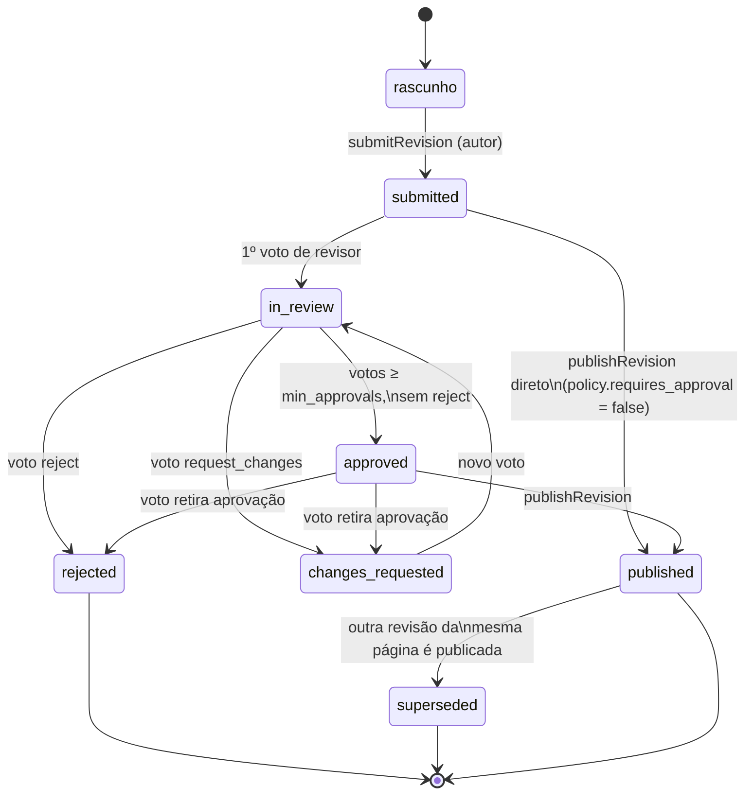

# ADR 004 — Fluxo editorial

| Campo       | Valor                                                                                                                                    |
| :---------- | :---------------------------------------------------------------------------------------------------------------------------------------- |
| Status      | **Aceito** em 2026-09-19, junto com os ADRs 002 e 003, dos quais depende estruturalmente                                                   |
| Data        | 2026-09-18                                                                                                                                |
| Camada      | Fluxo editorial (estados de revisão, papéis e permissões, política de aprovação por espaço, comentários ancorados, notificações, auditoria) |
| Depende de  | Arquitetura base; ADR 002 (formato de conteúdo, Proposto); ADR 003 (armazenamento e versionamento, Proposto)                               |
| Decide      | Máquina de estados de revisão; papéis e mapeamento para RLS; política de aprovação por espaço; modelo de dados de votos e comentários ancorados; regra de fixação (pin) do diagrama por revisão; eventos e notificações; trilha de auditoria |
| Não decide  | UI do editor e modo de sugestão de edição inline (ADR 005); renderização de diff visual (ADR 005/006); ranking e indexação de busca (ADR 009); exportação e sincronização (ADR 010); regras de publicação pública (ADR 011); RBAC completo de workspace/SSO (ADR de tenancy, pressuposto) |
| Reversível? | Parcialmente — ver seção 9                                                                                                                |

## 1. Decisão

**O fluxo editorial é uma máquina de estados própria, em Postgres, que estende diretamente o que o ADR 003 já construiu: `page_revisions` continua imutável, o status de cada revisão continua vivendo só em `revision_status_events` (append-only) projetado em `revision_current_status`. Este ADR acrescenta quatro tabelas — `content.space_editorial_policies` (política de aprovação por espaço), `content.revision_reviews` (voto individual de cada revisor, append-only), `content.revision_comments` (comentários ancorados, mutáveis) e `content.notifications` (fila de notificações in-app) — e um único artefato de código novo: uma tabela de transições declarada em TypeScript (`REVISION_TRANSITIONS`) que valida, no servidor, qual transição é legal a partir de qual estado e com qual papel. Nenhuma dependência nova é instalada.**

Por quê, em uma linha cada:

- **Reaproveitar, não reabrir, o ADR 003**: `revision_statuses` já foi semeada com exatamente os sete códigos que este ADR precisa (`submitted`, `in_review`, `changes_requested`, `approved`, `published`, `rejected`, `superseded`), e o próprio ADR 003 já declarou, na sua seção "fora de escopo", que a máquina de estados e os comentários ancorados são deste ADR. Construir em cima do que já existe custa dias, não semanas.
- **Papéis continuam sendo os quatro do ADR 003** (`admin`, `editor`, `reviewer`, `viewer`): o prompt sugere um quinto papel, "publicador", mas isso reabriria o `CHECK` de `space_members.role` do ADR 003 sem necessidade real hoje. "Quem pode publicar" vira uma **política por espaço** (`publish_role`), não um papel novo — ver seção 6.2 e a discordância registrada ali.
- **Voto é dado, status é derivado**: cada voto de revisor é uma linha imutável em `revision_reviews`; o status agregado (`approved`, `changes_requested`, `rejected`) é recalculado a cada voto novo, contra a política do espaço, e só então vira um evento em `revision_status_events`. Isso separa "o que um revisor disse" (histórico completo, nunca apagado) de "o que a revisão é agora" (uma projeção), do mesmo jeito que o ADR 003 separou conteúdo de status.
- **Diagrama fixado por referência, quando existir o que fixar**: o mecanismo grava a resolução em `page_refs.target_rev_id`, nunca injetando `rev=` no DokMD — preserva o round-trip byte a byte do ADR 002. Mas o ADR 003, revisado contra o schema real do Supabase, confirmou que diagramas (ADR 001: `public.views`/`model_elements`/`relationships`) são mutáveis e sem histórico hoje — não existe revisão de diagrama para fixar, então `target_rev_id` fica sempre `null`. O mecanismo fica pronto para ligar quando o ADR 001 versionar diagramas (seção 6.4); até lá, todo embed resolve dinamicamente, seja em rascunho ou em revisão publicada.
- **Sem serviço de terceiro para nada disto**: aprovação, comentário e notificação são dados do produto (auditáveis, multi-inquilino, sujeitos a RLS); nenhum dos três tem razão de negócio para morar fora do Supabase que já hospeda o resto.

> [!IMPORTANT]
> Este ADR usa a palavra "papel" para os quatro valores já fixados em `content.space_members.role` pelo ADR 003 (`admin`, `editor`, `reviewer`, `viewer`). O prompt deste ADR sugere um papel "publicador" separado — decidi não criar um quinto valor de papel. A razão está na seção 6.2; se o produto precisar mesmo de uma pessoa que aprova sem poder publicar e vice-versa, o gatilho de reabertura está na seção 10.

## 2. Contexto e entradas recebidas

Do LEDGER.md (Aceito):

- **ADR 001** — diagramas por id estável; view renderizável em modo leitura dentro de uma página.

Do ADR 002 (Proposto, entrada direta para este ADR):

- `::diagram{src="dok:diagram/<uuid>" view="<uuid>" rev="<uuid>?" title="…"}` — `rev` é opcional; quando ausente, "a revisão que o ADR 004 considerar corrente/publicada" (citação direta da seção 6.1 do ADR 002). Este ADR responde exatamente essa pergunta em aberto — seção 6.4.
- Restrição 7.4 do ADR 002: "Publicação fixa o que foi aprovado: `rev` opcional no `::diagram` permite a página publicada apontar para a revisão aprovada do diagrama." Este ADR não altera o texto do DokMD para cumprir isso — usa `page_refs` (ADR 003). Mas o ADR 003, ao revisar contra o schema real do Supabase, registrou essa fixação como sem backend hoje: diagramas do ADR 001 não têm histórico — ver seção 6.4.
- `extractText`/`collectRefs` já produzem, por revisão, tudo que este ADR precisa para calcular diffs e resolver o diagrama fixado; nenhuma função nova de parsing é criada aqui.

Do ADR 003 (Proposto, a base direta deste ADR):

- `page_revisions` é append-only e imutável (trigger `forbid_mutation`); `page_drafts` é mutável, um por autor por página, com `based_on_revision_id` para detectar concorrência (`RevisionConflictError`).
- `revision_statuses` já semeada com os sete estados; `revision_status_events` (append-only) + `revision_current_status` (projeção) + a trigger `apply_revision_status_event`, que já atualiza `pages.published_revision_id` quando `to_status = 'published'`. **Este ADR reaproveita essa trigger sem alterar uma linha dela.**
- `page_refs` já tem as colunas `target_view_id` e `target_rev_id`, "só kind = 'diagram'" — construídas no ADR 003 para o uso que este ADR faz delas. O próprio ADR 003 já registra como risco aberto que `target_rev_id` não tem o que referenciar hoje (diagramas do ADR 001 são mutáveis, sem revisão) — herdado aqui na seção 6.4 e nos riscos abertos deste ADR.
- RLS do ADR 003 (seção 6.3) já cobre `page_revisions`: revisão publicada visível a quem tem papel no espaço; revisão não publicada só ao autor e a `admin`/`reviewer`. Isto já resolve sozinho boa parte da pergunta 2 deste ADR ("o que o revisor vê").
- Premissa explícita do ADR 003 para este ADR: "Novos estados e papéis são linhas novas em `revision_statuses`/`revision_status_events`; comentários ancorados são uma tabela aditiva que referencia `revision_id`, sem alterar `page_revisions`." Este ADR cumpre a letra dessa premissa.
- O ADR 003 também deixou explícito, na sua seção 6.3, que "política completa [de RLS] é fora do escopo aqui" e não habilitou RLS em `revision_statuses`, `revision_status_events` nem `revision_current_status`. Este ADR fecha essa lacuna — não é reabertura, é a continuação que o próprio ADR 003 previu.

Do produto: pipeline de aprovação é requisito futuro explícito (rascunho → revisão → aprovação → publicação); Google Drive é espelho de mão única; exportação para Starlight/Obsidian/`.md`/`.docx`.

## 3. Critérios

### Eliminatórios (do prompt, literais)

| ID   | Critério                                                        | Por que, neste projeto                                                                    | Como verifico aqui                                                                                     |
| :--- | :----------------------------------------------------------------- | :---------------------------------------------------------------------------------------------- | :------------------------------------------------------------------------------------------------------- |
| W-01 | Estados e transições validados no servidor, nunca só na UI       | Um `PATCH` direto ou um bug de UI não pode publicar algo sem aprovação                          | Toda transição passa por uma server function que consulta `REVISION_TRANSITIONS`; RLS nega insert direto do cliente em `revision_status_events` |
| W-02 | Não exige que o cliente final tenha conta em serviço de terceiro | Revisor pode ser alguém do time do cliente, sem GitHub/Slack/etc.                               | A candidata depende de login em outro produto para votar ou comentar?                                    |
| W-03 | Auditoria imutável de quem fez cada transição                    | Compliance e disputa ("quem aprovou isso?") precisam de resposta que ninguém consiga apagar     | `revision_status_events` e `revision_reviews` são append-only, com a mesma trigger `forbid_mutation` do ADR 003 |

### Compatibilidade para trás

| ID   | Critério                                                                                          |
| :--- | :---------------------------------------------------------------------------------------------------- |
| B-01 | Compatível com a arquitetura base (Lovable, sem dependência nova sem justificativa)                    |
| B-02 | Compatível com o ADR 002 (texto canônico intocado; `rev` do `::diagram` continua opcional na sintaxe) |
| B-03 | Compatível com o ADR 003 (`page_revisions` continua imutável; nenhuma tabela nova altera seu schema)  |

### Importantes (peso, 0–3 por candidata sobrevivente)

| ID  | Critério                                                  | Peso | Por que, neste projeto                                                                 |
| :-- | :----------------------------------------------------------- | ---: | :------------------------------------------------------------------------------------------ |
| I-1 | Custo de implementação                                       |    5 | Time pequeno, projeto Lovable                                                              |
| I-2 | Flexibilidade para políticas futuras (min. de aprovadores, auto-publish, novos estados) | 3 | O produto já pede "no futuro" — o modelo precisa crescer sem migração |
| I-3 | Curva de aprendizado / manutenção pelo time                  |    3 | Quem mantiver isso depois não necessariamente conhece a biblioteca escolhida               |
| I-4 | Não duplica infraestrutura sem necessidade real do produto   |    2 | Nenhum requisito pede um motor de state machine dedicado ou um serviço de colaboração terceirizado |
| I-5 | Auditoria e consulta ad hoc via SQL                           |    2 | "Quem aprovou a página X na semana passada?" precisa ter resposta em uma query             |

## 4. Candidatas

| ID | Candidata                                                                   | Peças                                                                                     |
| :- | :----------------------------------------------------------------------------- | :--------------------------------------------------------------------------------------------- |
| A  | **Máquina de estados própria em Postgres**, estendendo as tabelas do ADR 003    | Só SQL (4 tabelas novas) + `REVISION_TRANSITIONS` em TS; nenhum pacote novo                     |
| B  | Biblioteca de state machine (XState) no servidor, orquestrando as mesmas tabelas | [xstate 5.31.0](https://www.npmjs.com/package/xstate) MIT (verificado 2026-09-18; a página pública do npm ainda lista 4.25.0 em cache, mas o registro e o `depscope` confirmam 5.31.0 como a última publicada) |
| C  | GitHub PR — cada página é um arquivo, revisão = branch, aprovação = review do GitHub | Nenhum pacote — depende da conta/API do GitHub                                                 |
| D  | Serviço terceirizado de comentários/colaboração (representativo: Liveblocks Comments) como armazenamento primário de votos e comentários | SDK proprietário (Liveblocks), SaaS fechado, fora do Supabase                                    |

## 5. Avaliação

### 5.1 Eliminatórios

| Requisito                              | A (Postgres próprio) | B (XState)                                                              | C (GitHub PR)                                                              | D (SaaS de colaboração)                                                      |
| :-------------------------------------- | :-------------------- | :------------------------------------------------------------------------ | :---------------------------------------------------------------------------- | :------------------------------------------------------------------------------- |
| W-01 validado no servidor              | C¹                    | C² — a máquina roda no servidor, mas ainda precisa da mesma RLS por baixo | N — o GitHub valida suas próprias transições de PR                            | C³ — o serviço valida o que é dele; o *fluxo editorial* (estados do ADR 003) continuaria sendo nosso |
| W-02 sem conta de terceiro              | N                     | N                                                                        | **X** — revisor e autor precisam de conta GitHub                              | C⁴ — o cliente final não precisa de conta própria (autenticação mediada pela nossa API), mas o produto passa a depender de infraestrutura de terceiro para uma função central |
| W-03 auditoria imutável                 | N                     | N (herda de A, os eventos ainda são gravados no Postgres)                | X — histórico de PR é editável/forçável (`force-push`, edição de review) pelo dono do repositório | **X⁵** — o log de eventos do serviço não está sob nosso controle direto; garantir imutabilidade exigiria espelhar tudo de volta para o Postgres, o que anula a vantagem de usar o serviço |
| B-01 compatível com base                | N                     | C — dependência nova, JS puro, instala normal no Lovable                | X (herda de W-02)                                                            | X (herda de W-03)                                                                |
| B-02 compatível com ADR 002             | N                     | N                                                                        | N                                                                              | N                                                                                 |
| B-03 compatível com ADR 003             | N                     | N                                                                        | **X** — premissa do ADR 003 é que comentários/estados moram em Postgres, não em blobs de arquivo de outro sistema | **X** — mesma premissa: "comentários ancorados são uma tabela aditiva que referencia `revision_id`"; um SaaS como fonte de verdade não cumpre isso sem duplicar tudo em Postgres de qualquer forma |

1. Custo: ~1 dia para escrever e testar `REVISION_TRANSITIONS` e as server functions que a usam (seção 6.3).
2. XState roda no server function da mesma forma que o código próprio rodaria; a diferença é que a lib define a máquina, mas a persistência do resultado ainda precisa ser escrita à mão contra as tabelas do ADR 003 — não elimina o trabalho de A, soma a ele.
3. Idem: mesmo com Liveblocks para votos/comentários, os *estados* `submitted`/`approved`/`published` continuam sendo nossos, então essa parte do trabalho de A não desaparece.
4. Liveblocks (e serviços equivalentes) autenticam via token emitido pelo nosso backend; o usuário final não vê a marca do terceiro. Não é X em W-02 — mas fica marcado como dependência estrutural nova.
5. Não é impossível obter um log auditável de um SaaS — é que garantir a imutabilidade *sob nosso controle* (parte central de W-03) exige replicar o evento para uma tabela nossa de qualquer forma, o que torna o serviço redundante com A.

**Eliminadas: C** (X em W-02, e um X sozinho já encerra a avaliação da candidata) **e D** (X em B-03 — conflita com a premissa explícita que o próprio ADR 003 registrou sobre esta camada, sem que haja justificativa de produto para reabrir aquele ADR).

B sobrevive aos eliminatórios — nada nela é estruturalmente incompatível — mas carrega uma dependência nova (B-01 vira C, não N) que precisa se justificar na ponderação.

### 5.2 Ponderação (A vs. B)

| Critério (peso)                              | A (Postgres próprio) | B (XState) |
| :--------------------------------------------- | ---------------------: | ------------: |
| I-1 Custo (5)                                  |                      3 |            1 |
| I-2 Flexibilidade de política (3)              |                      3 |            2 |
| I-3 Curva de aprendizado / manutenção (3)      |                      3 |            1 |
| I-4 Não duplica infraestrutura (2)             |                      3 |            1 |
| I-5 Auditoria via SQL (2)                      |                      3 |            3 |
| **Total (máx. 45)**                            |                 **45** |       **25** |

B perde principalmente em I-1, I-3 e I-4: os sete estados deste produto não têm estados paralelos, histórico ou hierarquia — o cenário em que um motor de statecharts paga o próprio custo. Sem esse cenário, XState vira uma camada de indireção sobre tabelas que já fariam o trabalho sozinhas, mais uma dependência que o time precisa aprender para debugar. **Decisão: A.**

## 6. Modelo do fluxo editorial

### 6.1 A máquina de estados

Estados (idênticos aos já semeados pelo ADR 003 em `content.revision_statuses` — nenhum `INSERT` novo é necessário):



> [!NOTE]
> "rascunho" não é um valor de `revision_statuses` — é `content.page_drafts` do ADR 003, mutável, anterior à existência de qualquer revisão. A seta `rascunho → submitted` é a criação da primeira linha imutável em `page_revisions`.

Resposta direta à pergunta 1 do prompt ("rejeitada → rascunho"): **não existe transição de banco `rejected → submitted`**, porque a revisão rejeitada é imutável — não há o que reabrir nela. O que existe é uma ação de página, não de revisão: o autor pede um **novo rascunho baseado na revisão rejeitada** (`initializeDraftFrom(revisionId)`, seção 6.5), que copia o texto para um `page_drafts` novo (ou reaproveita o existente do autor) com `based_on_revision_id` igual ao `published_revision_id` atual da página — exatamente a mesma checagem de conflito que o `submitRevision` do ADR 003 já faz. `changes_requested` tem `is_terminal = false` (valor que o próprio ADR 003 semeou) porque, ao contrário de `rejected`, ela **pode** voltar para `in_review` sem um rascunho novo — um revisor pode reconsiderar depois de uma conversa nos comentários, sem que o texto mude.

`published` não é totalmente terminal: quando outra revisão da mesma página é publicada, a antiga recebe automaticamente o evento `published → superseded`. Isso é efeito colateral de `publishRevision`, nunca uma ação manual — seção 6.3.

### 6.2 Papéis e política por espaço

Os quatro papéis de `content.space_members.role` (ADR 003) continuam exatamente como estão: `admin`, `editor`, `reviewer`, `viewer`. Mapeamento direto às perguntas do prompt:

| Termo do prompt | Papel usado                                                       |
| :--------------- | :------------------------------------------------------------------ |
| Leitor            | `viewer`                                                            |
| Autor             | `editor` (ou `admin`)                                                |
| Revisor           | `reviewer` (ou `admin`)                                              |
| Publicador        | **não é papel** — é `space_editorial_policies.publish_role`, restrito a `admin` ou `editor` |
| Admin             | `admin`                                                              |

Por que não um papel `publisher` dedicado: hoje ninguém no produto descreveu um caso em que a pessoa que aprova não deveria poder publicar, ou vice-versa — a distinção do prompt é razoável em abstrato, mas criar um quinto valor de papel muda o `CHECK` de `space_members.role` do ADR 003 (reabertura, com custo de migração de dado existente) para resolver um problema que a política por espaço já resolve sem tocar em schema aceito. Se isso mudar, é o primeiro gatilho de reabertura da seção 10.

```sql
create table content.space_editorial_policies (
  space_id                 uuid primary key references content.spaces(id) on delete cascade,
  requires_approval        boolean not null default true,
  min_approvals            integer not null default 1 check (min_approvals >= 1),
  allow_self_approval      boolean not null default false,
  publish_role             text not null default 'admin' check (publish_role in ('admin', 'editor')),
  auto_publish_on_approval boolean not null default false,
  updated_by               uuid not null references auth.users(id),
  updated_at               timestamptz not null default now()
);

-- toda espaço novo nasce com a política padrão, sem exigir coalesce nas queries
create or replace function content.seed_default_editorial_policy()
returns trigger language plpgsql as $$
begin
  insert into content.space_editorial_policies (space_id, updated_by)
  values (new.id, new.created_by);
  return new;
end;
$$;

create trigger spaces_seed_editorial_policy
  after insert on content.spaces
  for each row execute function content.seed_default_editorial_policy();
```

Resposta à pergunta 3 do prompt: aprovação **é obrigatória por padrão** (`requires_approval = true`, `min_approvals = 1`, `allow_self_approval = false`); um `admin` do espaço pode relaxar isso a qualquer momento (inclusive desligar aprovação por completo, liberando publicação direta a quem tiver `publish_role`). Autoaprovação — o autor da revisão votando na própria revisão — é bloqueada por padrão e só liberada explicitamente por espaço.

### 6.3 Votos, agregação e a tabela de transições

```sql
create table content.revision_reviews (
  id           bigint generated always as identity primary key,
  revision_id  uuid not null references content.page_revisions(id) on delete cascade,
  reviewer_id  uuid not null references auth.users(id),
  decision     text not null check (decision in ('approve', 'request_changes', 'reject')),
  comment      text,
  created_at   timestamptz not null default now()
);

create index revision_reviews_by_revision on content.revision_reviews (revision_id, reviewer_id, created_at desc);

create trigger revision_reviews_immutable
  before update or delete on content.revision_reviews
  for each row execute function content.forbid_mutation(); -- mesma função do ADR 003, reaproveitada

-- "voto vigente": um revisor pode votar de novo (reconsiderar); só o voto mais recente conta na agregação
create view content.revision_reviews_current as
select distinct on (revision_id, reviewer_id)
  revision_id, reviewer_id, decision, comment, created_at
from content.revision_reviews
order by revision_id, reviewer_id, created_at desc;
```

A tabela de transições é o único artefato de código deste ADR (o "C" da avaliação). Ela é consultada por toda server function antes de qualquer `insert` em `revision_status_events` — é o que cumpre W-01 na prática, não a RLS sozinha (a RLS impede o cliente de inserir direto; a tabela de transições impede a própria server function de gravar um par ilegal):

```ts
// src/editorial-flow/transitions.ts
import type { RevisionStatus } from '@/content-store/types' // do ADR 003

export type Role = 'admin' | 'editor' | 'reviewer'
export type TransitionActor = Role | 'system'

export interface Transition {
  from: RevisionStatus | null // null = criação (rascunho → submitted)
  to: RevisionStatus
  actor: TransitionActor
}

export const REVISION_TRANSITIONS: readonly Transition[] = [
  { from: null, to: 'submitted', actor: 'editor' },
  { from: null, to: 'submitted', actor: 'admin' },
  { from: 'submitted', to: 'published', actor: 'admin' }, // bypass, exige policy.requires_approval = false
  { from: 'submitted', to: 'published', actor: 'editor' }, // idem, só se policy.publish_role = 'editor'
  { from: 'submitted', to: 'in_review', actor: 'reviewer' },
  { from: 'submitted', to: 'in_review', actor: 'admin' },
  { from: 'in_review', to: 'approved', actor: 'reviewer' },
  { from: 'in_review', to: 'approved', actor: 'admin' },
  { from: 'in_review', to: 'changes_requested', actor: 'reviewer' },
  { from: 'in_review', to: 'changes_requested', actor: 'admin' },
  { from: 'in_review', to: 'rejected', actor: 'reviewer' },
  { from: 'in_review', to: 'rejected', actor: 'admin' },
  { from: 'changes_requested', to: 'in_review', actor: 'reviewer' },
  { from: 'changes_requested', to: 'in_review', actor: 'admin' },
  { from: 'approved', to: 'published', actor: 'admin' },
  { from: 'approved', to: 'published', actor: 'editor' }, // idem, publish_role = 'editor'
  { from: 'approved', to: 'changes_requested', actor: 'reviewer' },
  { from: 'approved', to: 'rejected', actor: 'reviewer' },
  { from: 'published', to: 'superseded', actor: 'system' }, // nunca acionado por usuário direto
] as const

export function isTransitionAllowed(
  from: RevisionStatus | null,
  to: RevisionStatus,
  actor: TransitionActor,
): boolean {
  return REVISION_TRANSITIONS.some((t) => t.from === from && t.to === to && t.actor === actor)
}
```

`castReviewVote` é a única server function que produz um voto e, quando a agregação cruza o limiar da política, também o evento de status correspondente — na mesma transação:

```ts
// src/editorial-flow/server.ts — assinaturas
import type { UUID, RevisionStatus } from '@/content-store/types'

export type ReviewDecision = 'approve' | 'request_changes' | 'reject'

export interface SpaceEditorialPolicy {
  spaceId: UUID
  requiresApproval: boolean
  minApprovals: number
  allowSelfApproval: boolean
  publishRole: 'admin' | 'editor'
  autoPublishOnApproval: boolean
}

export class SelfApprovalForbiddenError extends Error {}
export class IllegalTransitionError extends Error {
  constructor(public readonly from: RevisionStatus | null, public readonly to: RevisionStatus) {
    super(`Transição ${from ?? '(criação)'} → ${to} não permitida para este ator`)
  }
}

export function getSpaceEditorialPolicy(spaceId: UUID): Promise<SpaceEditorialPolicy>
export function upsertSpaceEditorialPolicy(
  input: Partial<SpaceEditorialPolicy> & { spaceId: UUID; actorId: UUID },
): Promise<SpaceEditorialPolicy> // exige papel admin; checado por RLS e reforçado na função

export function castReviewVote(input: {
  revisionId: UUID
  reviewerId: UUID
  decision: ReviewDecision
  comment?: string
}): Promise<{ vote: { decision: ReviewDecision }; newStatus: RevisionStatus }>
// 1. valida papel (reviewer/admin) e allow_self_approval via getSpaceEditorialPolicy
// 2. insere em revision_reviews
// 3. lê revision_reviews_current + policy, decide o status agregado
// 4. valida o par (status atual, status agregado) contra isTransitionAllowed
// 5. se mudou, insere em revision_status_events (reaproveita a trigger do ADR 003)
// 6. se newStatus = 'approved' e policy.autoPublishOnApproval, encadeia publishRevision na mesma transação

export function publishRevision(input: { revisionId: UUID; actorId: UUID }): Promise<{ pageId: UUID }>
// 1. valida papel do ator contra policy.publishRole
// 2. lê pages.published_revision_id ANTES de publicar (guarda como previousId)
// 3. insere evento to_status = 'published' — a trigger do ADR 003 atualiza pages.published_revision_id
// 4. se previousId existe e é diferente do novo: insere um segundo evento,
//    revision_id = previousId, from_status = 'published', to_status = 'superseded', actor_id = actorId
//    (mesma trigger do ADR 003, sem modificá-la; a ordem é garantida pela transação desta função,
//     não por outra trigger competindo em ordem alfabética)

export function initializeDraftFrom(input: { revisionId: UUID; authorId: UUID }):
  Promise<{ pageId: UUID }> // copia content_dokmd da revisão indicada para um page_drafts do autor
```

> [!TIP]
> A sequência do passo 2–4 de `publishRevision` é o único ponto deste ADR que toca o efeito "revisão anterior vira `superseded`". Ele funciona por ordenação explícita dentro de uma única função/transação — de propósito, para não competir com a trigger `apply_revision_status_event` do ADR 003, que continua exatamente como foi escrita.

### 6.4 Diagramas: a regra está definida, mas ainda não tem efeito

Resposta à pergunta 5 do prompt, com uma ressalva que só apareceu ao reanalisar o ADR 003 nesta rodada: **a regra que decido aqui é "a revisão publicada mostra sempre o mesmo diagrama que existia quando foi submetida, a menos que o autor tenha escrito `rev=` explicitamente" — mas hoje essa regra não tem o que fixar.**

> [!WARNING]
> O ADR 003, revisado contra `supabase-types-dokdraw.ts`, confirmou que `dok:diagram/<uuid>` resolve para `public.projects` e `view=<uuid>` para `public.views` (que agrega `view_nodes`, `model_elements`, `relationships`) — todas tabelas **mutáveis, editadas in-place, sem histórico**. Não existe "a revisão do diagrama tal como estava no dia X" para gravar em `page_refs.target_rev_id`, porque o ADR 001 nunca criou esse conceito. A coluna existe (o ADR 003 já a desenhou), mas fica sempre `null` até o ADR 001, ou uma extensão dele, decidir versionar diagramas.

Mecanismo definido, pronto para ligar quando isso existir:

- Se o autor escreveu `rev="<uuid>"` no `::diagram`: `collectRefs` (ADR 002) já extrai esse id normalmente — isso não depende de nada do ADR 001, é só o texto sendo lido. Fica gravado em `page_refs.target_rev_id`, mesmo sem um jeito de validar hoje que esse `rev` corresponde a algo real.
- Se `rev` está ausente (o caso comum): no momento do `submitRevision`, `collectRefs` grava `page_refs.target_rev_id = null` — não há "revisão atual do diagrama" para resolver.
- Quando o ADR 001 entregar histórico de diagrama, a mudança fica inteira do lado de quem resolve a referência (a função que hoje grava `null` passa a gravar o id da revisão atual do diagrama), sem tocar em `page_refs`, `collectRefs` ou no texto DokMD — o contrato desta seção já está desenhado para esse dia.

O que isso significa **hoje**, na prática: todo embed de diagrama — em rascunho, em revisão em análise, em revisão publicada há um ano — resolve sempre ao estado **atual** do diagrama. Um revisor pode aprovar uma página vendo um diagrama que, minutos depois, alguém edita sem deixar rastro naquela revisão; uma revisão publicada há meses mostra o diagrama de hoje, não o de quando foi aprovada. Isso fica registrado como risco aberto (seção 13) e como gatilho de reabertura (seção 10) — não é um problema que este ADR resolve sozinho, porque a peça que falta é do ADR 001.

### 6.5 Comentários ancorados

```sql
create table content.revision_comments (
  id                 bigint generated always as identity primary key,
  revision_id        uuid not null references content.page_revisions(id) on delete cascade,
  author_id          uuid not null references auth.users(id),
  body               text not null,
  anchor_start_line  integer, -- null = comentário geral da revisão, não ancorado a um trecho
  anchor_end_line    integer,
  parent_comment_id  bigint references content.revision_comments(id), -- thread de respostas
  resolved           boolean not null default false,
  resolved_by        uuid references auth.users(id),
  resolved_at        timestamptz,
  created_at         timestamptz not null default now()
);

create index revision_comments_by_revision on content.revision_comments (revision_id);
```

Âncora por **faixa de linhas** do `content_dokmd` daquela revisão específica: como a revisão é imutável, a âncora nunca fica obsoleta *para aquela revisão* (ao contrário de uma âncora por heading, que quebraria se o heading mudasse — o mesmo problema que o ADR 002 já registrou para links âncora). Comparar comentários entre duas revisões diferentes da mesma página (para saber se um comentário "já foi endereçado" na próxima) é responsabilidade de UI do ADR 005, usando o diff de texto entre as duas — este ADR só garante que cada comentário sabe exatamente a que revisão e que linhas pertence.

Ao contrário de `page_revisions` e `revision_reviews`, `revision_comments` **é mutável** — editar um comentário ou marcá-lo como resolvido não é reescrita de histórico de conteúdo, é a mesma natureza de dado que um comentário em qualquer ferramenta colaborativa. Isso está dentro do que o ADR 003 previu ("comentários ancorados são uma tabela aditiva... sem alterar `page_revisions`") — a imutabilidade exigida era da revisão, não do comentário.

Resposta à pergunta 4 do prompt sobre modo de sugestão (track changes/suggestion mode): **fora deste ADR, decidido como não incluído na v1.** Fundamento: o texto canônico é sempre reescrito inteiro pelo `normalizeDok` no save (ADR 002); um modo de sugestão de verdade (aceitar/rejeitar trechos) precisaria de um formato de patch que sobrevivesse à normalização, o que é um problema de editor (ADR 005), não de fluxo editorial. Fica registrado como possível gatilho de reabertura — seção 10 — e como requisito explícito para o ADR 005 avaliar, não para este ADR resolver.

### 6.6 Notificações e trilha de auditoria

```sql
create table content.notifications (
  id           bigint generated always as identity primary key,
  workspace_id uuid not null references public.workspaces(id) on delete cascade,
  recipient_id uuid not null references auth.users(id),
  kind         text not null check (kind in (
                 'revision_submitted', 'revision_review_started', 'revision_changes_requested',
                 'revision_approved', 'revision_rejected', 'revision_published',
                 'comment_added', 'comment_resolved'
               )),
  revision_id  uuid references content.page_revisions(id) on delete cascade,
  comment_id   bigint references content.revision_comments(id) on delete cascade,
  actor_id     uuid references auth.users(id),
  read_at      timestamptz,
  created_at   timestamptz not null default now()
);

create index notifications_by_recipient on content.notifications (recipient_id, read_at, created_at desc);
```

Resposta à pergunta 6 do prompt: **só in-app na v1.** A tabela já cobre o suficiente para um job assíncrono de e-mail transacional ser plugado depois (lendo `notifications` como fila) sem migração — mas escolher provedor de e-mail e desenhar os templates fica fora de escopo (seção 12).

A trilha de auditoria em si (W-03) **não é a tabela `notifications`** — é `revision_status_events` (transições) e `revision_reviews` (votos individuais), ambas já append-only pela trigger `forbid_mutation` do ADR 003, reaproveitada aqui sem alteração. "Quem aprovou a página X" é sempre uma query direta contra essas duas tabelas, nunca uma dedução a partir de notificações (que podem ser apagadas pelo usuário ao marcar como lida — por isso não carregam peso de auditoria).

### 6.7 RLS

```sql
alter table content.space_editorial_policies enable row level security;
alter table content.revision_reviews          enable row level security;
alter table content.revision_comments         enable row level security;
alter table content.notifications             enable row level security;

-- lacunas que o ADR 003 deixou explicitamente fora do escopo dele (seção 6.3: "política completa é fora do escopo aqui")
alter table content.revision_statuses         enable row level security;
alter table content.revision_status_events    enable row level security;
alter table content.revision_current_status   enable row level security;

create policy revision_statuses_select on content.revision_statuses for select
  using (auth.role() = 'authenticated'); -- vocabulário fixo, sem dado de inquilino

create policy revision_status_events_select on content.revision_status_events for select using (
  exists (
    select 1
    from content.page_revisions r
    join content.pages p on p.id = r.page_id
    left join content.revision_current_status rcs on rcs.revision_id = r.id
    where r.id = revision_status_events.revision_id
      and (
        (coalesce(rcs.status_code, 'submitted') = 'published' and content.effective_role(p.space_id, auth.uid()) is not null)
        or r.author_id = auth.uid()
        or content.effective_role(p.space_id, auth.uid()) in ('admin', 'reviewer')
      )
  )
); -- mesma regra de visibilidade que o ADR 003 já usa para page_revisions; sem policy de insert — só server function (security definer)

create policy revision_current_status_select on content.revision_current_status for select using (
  exists (select 1 from content.revision_status_events e where e.revision_id = revision_current_status.revision_id)
);

create policy space_policies_select on content.space_editorial_policies for select using (
  content.effective_role(space_id, auth.uid()) is not null
);
create policy space_policies_write on content.space_editorial_policies for all using (
  content.effective_role(space_id, auth.uid()) = 'admin'
) with check (
  content.effective_role(space_id, auth.uid()) = 'admin'
);

create policy revision_reviews_select on content.revision_reviews for select using (
  exists (
    select 1 from content.page_revisions r join content.pages p on p.id = r.page_id
    where r.id = revision_reviews.revision_id
      and (r.author_id = auth.uid() or content.effective_role(p.space_id, auth.uid()) in ('admin', 'reviewer'))
  )
);
create policy revision_reviews_insert on content.revision_reviews for insert with check (
  reviewer_id = auth.uid()
  and exists (
    select 1
    from content.page_revisions r
    join content.pages p on p.id = r.page_id
    left join content.space_editorial_policies pol on pol.space_id = p.space_id
    where r.id = revision_reviews.revision_id
      and content.effective_role(p.space_id, auth.uid()) in ('admin', 'reviewer')
      and (r.author_id <> auth.uid() or coalesce(pol.allow_self_approval, false))
  )
);

create policy revision_comments_select on content.revision_comments for select using (
  exists (
    select 1 from content.page_revisions r join content.pages p on p.id = r.page_id
    where r.id = revision_comments.revision_id
      and (
        r.author_id = auth.uid()
        or content.effective_role(p.space_id, auth.uid()) in ('admin', 'reviewer')
        or exists (select 1 from content.revision_current_status rcs where rcs.revision_id = r.id and rcs.status_code = 'published')
      )
  )
);
create policy revision_comments_insert on content.revision_comments for insert with check (
  author_id = auth.uid()
  and exists (
    select 1 from content.page_revisions r join content.pages p on p.id = r.page_id
    where r.id = revision_comments.revision_id and content.effective_role(p.space_id, auth.uid()) is not null
  )
);
create policy revision_comments_update_own on content.revision_comments for update
  using (author_id = auth.uid()) with check (author_id = auth.uid());

create policy notifications_own on content.notifications for select using (recipient_id = auth.uid());
create policy notifications_mark_read on content.notifications for update
  using (recipient_id = auth.uid()) with check (recipient_id = auth.uid());
```

## 7. Verificação de compatibilidade

### 7.1 Para trás — arquitetura base

| Contrato ou restrição                                | Situação   | Evidência                                                                              |
| :------------------------------------------------------ | :--------- | :------------------------------------------------------------------------------------------ |
| TanStack Start + React 19 + Vite + TS strict            | Compatível | `src/editorial-flow/` só server functions e tipos; sem componente React aqui                 |
| Supabase multi-inquilino                                 | Compatível | Toda tabela nova referencia `workspace_id` (via `spaces`) ou é escopada por `space_id`        |
| Lovable: só npm, sem build nativo nem postinstall        | Compatível | Zero dependências novas — candidata vencedora é SQL + TS puro                                |
| Dependência nova só com justificativa                    | Compatível | Nenhuma dependência nova; XState foi avaliado e perdeu na ponderação (seção 5.2)              |

### 7.2 Para trás — ADR 002 (Proposto)

| Restrição do ADR 002                                                    | Situação   | Evidência                                                                                     |
| :---------------------------------------------------------------------------- | :--------- | :------------------------------------------------------------------------------------------------ |
| Texto canônico é a fonte de verdade gravada; `normalizeDok` não perde significado | Compatível | A regra de diagrama grava em `page_refs.target_rev_id`, nunca reescreve `content_dokmd`          |
| `rev` opcional no `::diagram`, resolução "corrente/publicada" delegada ao ADR 004 | Compatível, mecanismo inerte | Seção 6.4 define a regra; sem histórico de diagrama no ADR 001 ela ainda não tem efeito — risco aberto registrado |
| Diff legível (I-5 do ADR 002)                                                  | Compatível | Diff é sempre sobre `content_dokmd` de duas revisões — texto puro, sem reescrita de marcadores entre saves |

### 7.3 Para trás — ADR 003 (Proposto)

| Restrição do ADR 003                                                                          | Situação   | Evidência                                                                                     |
| :---------------------------------------------------------------------------------------------- | :--------- | :------------------------------------------------------------------------------------------------ |
| `page_revisions` nunca é `UPDATE`/`DELETE`                                                       | Compatível | Nenhuma tabela ou função deste ADR toca essa tabela além de leitura                                |
| Status editorial nunca é coluna de `page_revisions`, sempre evento em `revision_status_events`   | Compatível | `castReviewVote`/`publishRevision` só inserem eventos; a trigger de projeção do ADR 003 não é alterada |
| `revision_statuses` como vocabulário aberto que ADR 004 usa livremente                            | Compatível | Nenhum `INSERT`/`UPDATE` novo em `revision_statuses` — os sete códigos já bastam                   |
| "comentários ancorados são tabela aditiva que referencia `revision_id`, sem alterar `page_revisions`" | Compatível | `revision_comments.revision_id` é a única ligação; `page_revisions` intocada                        |
| `page_refs.target_rev_id`, "só kind = 'diagram'"                                                 | Compatível | Usada para o propósito com que foi desenhada — seção 6.4 — mas o próprio ADR 003 já registra que fica sempre `null` hoje, por falta de histórico em `public.views`/`model_elements` (ADR 001) |
| "política completa [de RLS] é fora do escopo aqui" (ADR 003, seção 6.3)                          | Completado | Seção 6.7 fecha a lacuna que o próprio ADR 003 deixou aberta, sem tocar nas políticas já escritas   |

### 7.4 Para frente

| Camada seguinte                | Premissa                                                                                                          | Situação                                                                                                       |
| :---------------------------------- | :---------------------------------------------------------------------------------------------------------------- | :------------------------------------------------------------------------------------------------------------- |
| Edição (ADR 005)                    | Editor precisa de: visualização de diff (texto e renderizado) contra a versão publicada; modo comentário ancorado por faixa de linha; indicador de "revisão minha em `changes_requested`"; modo somente leitura para quem não é autor/revisor | Atende — lista vira eliminatório/importante explícito do ADR 005, conforme pedido pelo prompt                  |
| Busca (ADR 009)                     | Indexa só `pages.published_revision_id`                                                                            | Atende — nada muda na visibilidade que o ADR 003 já define; nenhuma revisão não-publicada é exposta à busca pública |
| Publicação (ADR 011)                | Só revisões com `to_status = 'published'` (via `pages.published_revision_id`) aparecem em qualquer superfície pública | Atende — mesma barreira usada por Busca e Exportação                                                            |
| Exportação e sync (ADR 010)         | Exporta e sincroniza só publicadas por padrão; rascunho é exportável manualmente, só pelo próprio autor, fora do pipeline de sync | Atende — RLS de `page_drafts` (ADR 003) já restringe rascunho ao autor; a ação de exportar rascunho é individual, nunca entra em `sync_state` |
| Renderização (ADR 007)              | Resolve o embed de diagrama via `page_refs`                                                                        | Atende parcialmente — hoje só há resolução dinâmica (seção 6.4); a resolução por `target_rev_id` fica pronta para quando o ADR 001 versionar diagramas |

## 8. Spike

Não há `?` em nenhum eliminatório — W-01/W-02/W-03 saem decididos direto na avaliação (seção 5), sem necessidade de prova empírica. Uma verificação **não bloqueante**, no mesmo espírito da seção 8 do ADR 003:

| Item                                            | O que verificar                                                                                     | Por quê                                                                                     |
| :------------------------------------------------ | :------------------------------------------------------------------------------------------------------ | :------------------------------------------------------------------------------------------ |
| Concorrência de voto                              | Dois revisores votando na mesma revisão ao mesmo tempo não podem gerar dois eventos de status conflitantes | `castReviewVote` precisa rodar a leitura de `revision_reviews_current` + a decisão + o insert do evento dentro de uma transação com isolamento que evite corrida; testar com `SELECT ... FOR UPDATE` na linha de `revision_current_status` |

## 9. Consequências

**Positivas**

- Nenhuma dependência nova; todo o fluxo editorial é SQL + um arquivo de configuração TS testável isoladamente.
- Voto e status separados: o histórico de "quem votou o quê" nunca é perdido nem quando o status agregado muda de opinião.
- O mecanismo de fixação de diagrama (seção 6.4) já responde à regra de negócio sem tocar no texto canônico — só falta o ADR 001 entregar histórico de diagrama para ele passar a valer de fato.
- RLS fecha exatamente a lacuna que o ADR 003 disse que deixaria aberta — nenhuma tabela de conteúdo/fluxo fica sem política.

**Negativas**

- Nenhum papel dedicado de "publicador" — se o produto pedir separação real entre aprovar e publicar, é mudança de schema no ADR 003 (mitigação: seção 10, gatilho de reabertura já registrado).
- Sem modo de sugestão de edição (track changes) na v1 — revisor só comenta e vota, não edita inline (mitigação: aditivo depois, é decisão do ADR 005 sobre formato de patch, não deste ADR).
- Agregação de votos (`revision_reviews_current`) é uma `VIEW`, recalculada a cada leitura — para espaços com muitos revisores e muito volume, pode exigir materialização depois (mitigação: troca de `VIEW` por tabela materializada é interna, não muda o contrato de saída).
- Fixação de diagrama por revisão é hoje inerte: sem histórico de diagrama no ADR 001, todo embed resolve sempre ao estado atual, mesmo em revisões publicadas antigas (mitigação: gatilho de reabertura na seção 10; quando resolvido, nada muda no schema deste ADR, só passa a preencher `target_rev_id`).

**Reversibilidade**

- Ajustar a política por espaço (limiares, papéis de publicação) é `UPDATE` em uma linha — custo zero.
- Adicionar um novo estado (ex.: `withdrawn`, autor retira a própria revisão) é aditivo: uma linha em `revision_statuses` + entradas novas em `REVISION_TRANSITIONS` — dias, não semanas, exatamente como o ADR 003 prometeu.
- Adicionar um papel `publisher` dedicado é caro: migração do `CHECK` de `space_members.role`, backfill de dados existentes, e reavaliação de toda RLS que hoje distingue só `admin`/`editor`/`reviewer`/`viewer` — estimativa: 3–4 dias.
- Trocar a agregação de votos por um motor de regras mais expressivo (ex.: aprovação por categoria de revisor) é a mudança mais cara: reescreve `castReviewVote` e possivelmente o schema de `space_editorial_policies` — semanas.

## 10. Gatilhos de reabertura

- Produto pedir separação real entre quem aprova e quem publica, com um papel dedicado (`publisher`) que não seja simplesmente uma política de espaço.
- Necessidade de aprovação por categoria de revisor (ex.: um aprovador técnico e um aprovador de negócio, ambos obrigatórios) — a agregação atual só conta votos, não categoriza revisores.
- Modo de sugestão de edição (track changes) virar requisito — muda o modelo de comentários e provavelmente o pipeline de save do ADR 002.
- E-mail transacional se tornar requisito obrigatório (hoje é só a tabela `notifications`, sem provedor escolhido).
- Volume de votos/comentários por revisão exigir paginação ou agregação diferente da `VIEW` atual.
- `effective_role()` (reaproveitada do ADR 003) não escalar sob a carga adicional das novas policies — mesmo gatilho já registrado no ADR 003, agravado por mais tabelas consultando a função.
- ADR 001 (ou uma extensão dele) versionar diagramas — ativa de fato a fixação por revisão desenhada na seção 6.4, hoje inerte.

## 11. Fatias de implementação

Em ordem de dependência.

| #  | Fatia                                                                                           | Depende de                    | Estimativa (dias) | Pronto quando                                                                                                                        |
| :- | :------------------------------------------------------------------------------------------------ | :----------------------------- | -----------------: | :---------------------------------------------------------------------------------------------------------------------------------- |
| E1 | Tabelas novas (`space_editorial_policies`, `revision_reviews`, `revision_comments`, `notifications`) + RLS completa, incluindo as lacunas deixadas pelo ADR 003 (`revision_statuses`, `revision_status_events`, `revision_current_status`) | ADR 003 S1, S2                 |                1.5 | Migração aplica limpo; toda `space` nova ganha política padrão automaticamente; dois usuários com papéis diferentes confirmam isolamento nas tabelas novas |
| E2 | `REVISION_TRANSITIONS` + `isTransitionAllowed` + testes cobrindo cada par do FSM                   | E1                              |                  1 | 100% dos pares legais da seção 6.1 passam; todo par fora da lista lança `IllegalTransitionError`                                     |
| E3 | Server functions: `castReviewVote`, `publishRevision` (com a sequência explícita de `superseded`), `getSpaceEditorialPolicy`, `upsertSpaceEditorialPolicy`, `initializeDraftFrom` | E1, E2, ADR 003 S3              |                  2 | Fluxo completo rascunho → `submitted` → `in_review` → `approved` → `published` funciona; caso `auto_publish_on_approval` e caso de bypass (`requires_approval = false`) cobertos por teste |
| E4 | Comentários ancorados: `createComment`, `resolveComment`, `listComments`                            | E1                              |                  1 | Comentário sobrevive a nova consulta da revisão; thread de resposta funciona; `resolved_by`/`resolved_at` preenchidos corretamente     |
| E5 | Notificações: trigger de fan-out (`revision_status_events` → `notifications`; `revision_comments` → `notifications`) + `markNotificationRead` | E1, E3, E4                      |                  1 | Cada transição de estado gera notificação para autor e revisores relevantes; cada comentário novo notifica os participantes da thread |
| E6 | Resolução de `rev` no `::diagram`: `collectRefs` grava `page_refs.target_rev_id` quando explícito no texto; quando implícito, grava `null` e documenta que aguarda o ADR 001. **A fixação automática por revisão fica bloqueada** até o ADR 001 versionar diagramas (seção 6.4) | ADR 002 F3, ADR 003 S4          |                0.5 | `target_rev_id` reflete o `rev` explícito quando presente; ausência de `rev` grava `null` sem erro; nenhuma tentativa de resolver "revisão atual do diagrama" acontece nesta fatia                          |

Total: 7 dias.

## 12. Fora de escopo

| Assunto                                                                       | Vai para                             |
| :--------------------------------------------------------------------------------- | :---------------------------------------- |
| Modo de sugestão de edição inline (track changes)                                  | ADR 005 (se e quando virar requisito)      |
| UI de revisão, diff visual lado a lado, indicadores de "revisão minha em changes_requested" | ADR 005                              |
| Renderização de página, resolução visual de `page_refs.target_rev_id`              | ADR 007                                    |
| Versionamento de diagramas (histórico de `views`/`model_elements`) — pré-condição para a fixação da seção 6.4 valer de fato | ADR 001 (extensão), se e quando decidido |
| Ranking e indexação de busca                                                       | ADR 009                                    |
| Lógica de exportação e sincronização com Drive                                     | ADR 010                                    |
| Regras de publicação pública, domínio customizado                                  | ADR 011                                    |
| Provedor de e-mail transacional, templates de notificação                          | Futuro, fora de escopo do produto atual    |
| RBAC completo de workspace (convites, SSO)                                         | ADR de tenancy/auth (pressuposto, herdado do ADR 003) |
| Papel dedicado de "publicador"                                                     | Reabertura do ADR 003, se necessário (seção 10) |

## 13. Contrato de saída

```yaml
adr: "004"
camada: "Fluxo editorial"
status: "Aceito"
data: "2026-09-18"
decisao: "Máquina de estados própria em Postgres, estendendo o ADR 003: revision_reviews (votos append-only) agrega para revision_status_events conforme a política de space_editorial_policies; revision_comments (ancorados por faixa de linha) e notifications são tabelas aditivas; a regra e o mecanismo de fixação de diagrama via page_refs.target_rev_id ficam definidos para quando o ADR 001 versionar diagramas — hoje a coluna é sempre null e o DokMD nunca é reescrito para incluir rev."
dependencias: []
interfaces_publicadas:
  - nome: "RevisionStatus (enum)"
    tipo: "tipo TS"
    descricao: "submitted | in_review | changes_requested | approved | published | rejected | superseded — idêntico ao já semeado em content.revision_statuses pelo ADR 003"
  - nome: "REVISION_TRANSITIONS / isTransitionAllowed"
    tipo: "função"
    descricao: "src/editorial-flow/transitions.ts; tabela declarativa de (from, to, actor) — seção 6.3 — única fonte de verdade sobre quais transições são legais"
  - nome: "content.space_editorial_policies / content.revision_reviews / content.revision_comments / content.notifications"
    tipo: "tabela"
    descricao: "Schema completo na seção 6, com RLS na seção 6.7"
  - nome: "castReviewVote / publishRevision / getSpaceEditorialPolicy / upsertSpaceEditorialPolicy / initializeDraftFrom"
    tipo: "função"
    descricao: "src/editorial-flow/server.ts; server functions do TanStack Start, seção 6.3"
  - nome: "Eventos emitidos"
    tipo: "evento"
    descricao: "Um evento por linha nova em revision_status_events (to_status = submitted|in_review|changes_requested|approved|published|rejected|superseded) e por linha nova em revision_comments; consumidos hoje só pelo fan-out para notifications, disponíveis para ADR 010/011 via leitura direta ou Realtime sobre essas tabelas"
restricoes_impostas:
  - "Toda transição de status passa por uma server function que consulta REVISION_TRANSITIONS antes de inserir em revision_status_events; RLS nega insert direto do cliente nessa tabela"
  - "revision_reviews é append-only (trigger forbid_mutation do ADR 003, reaproveitada); um novo voto do mesmo revisor é uma linha nova, nunca um UPDATE"
  - "Autoaprovação (revisor = autor da revisão) é bloqueada a menos que space_editorial_policies.allow_self_approval = true"
  - "Só revisões publicadas (pages.published_revision_id) aparecem para leitores, na busca pública, na publicação e no sync — salvo ação manual do próprio autor exportando seu rascunho"
  - "Diagrama referenciado sem rev explícito nunca tem o DokMD reescrito para incluí-lo; a fixação em page_refs.target_rev_id é o mecanismo definido para quando o ADR 001 versionar diagramas — até lá a coluna fica null e a resolução é sempre dinâmica"
  - "page_revisions permanece imutável; nenhuma tabela ou função deste ADR insere, altera ou apaga uma linha ali além de leitura"
premissas_sobre_camadas_futuras:
  - camada: "Edição (ADR 005)"
    premissa: "Implementa diff textual e renderizado contra a versão publicada, modo de comentário ancorado por faixa de linha, indicador de revisão em changes_requested e modo somente leitura; decide se e como entra modo de sugestão de edição"
  - camada: "Renderização (ADR 007)"
    premissa: "Hoje resolve todo embed de diagrama dinamicamente, em rascunho ou em qualquer revisão, porque page_refs.target_rev_id é sempre null; quando o ADR 001 versionar diagramas, passa a resolver revisões específicas pelo target_rev_id fixado, mantendo resolução dinâmica só para rascunhos"
  - camada: "Busca (ADR 009)"
    premissa: "Indexa exclusivamente via pages.published_revision_id; nenhuma revisão em submitted/in_review/changes_requested/approved é exposta à busca pública"
  - camada: "Exportação e sync (ADR 010)"
    premissa: "Exporta e sincroniza só publicadas por padrão; exportação de rascunho é ação manual do próprio autor, fora do pipeline de sync_state"
  - camada: "Publicação (ADR 011)"
    premissa: "Qualquer superfície pública respeita a mesma barreira de pages.published_revision_id usada por Busca e Exportação"
riscos_abertos:
  - "Sem papel dedicado de publicador — publish_role é política, não papel; ver gatilho de reabertura"
  - "revision_reviews_current é VIEW, não materializada; performance sob alto volume de votos não verificada"
  - "Provedor de e-mail e templates de notificação não escolhidos — só a tabela notifications está pronta para alimentar isso depois"
  - "Concorrência de voto (dois revisores votando ao mesmo tempo) precisa de verificação não bloqueante — seção 8"
  - "page_refs.target_rev_id fica sempre null hoje: diagramas do ADR 001 (public.views/model_elements/relationships) são mutáveis, sem histórico — mesmo risco que o ADR 003 já registrou, herdado aqui porque a regra de negócio de fixação é deste ADR"
gatilhos_de_reabertura:
  - "Produto pedir papel dedicado de publicador, separado de quem aprova"
  - "Aprovação por categoria de revisor (não só contagem) virar requisito"
  - "Modo de sugestão de edição inline virar requisito"
  - "E-mail transacional virar requisito obrigatório"
  - "effective_role() não escalar sob a carga das novas policies (agrava o gatilho já registrado no ADR 003)"
  - "ADR 001 (ou extensão dele) versionar diagramas — ativa de fato a fixação por revisão da seção 6.4"
```
