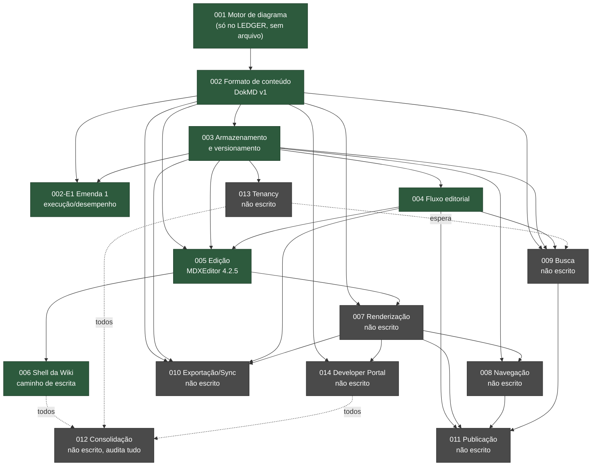
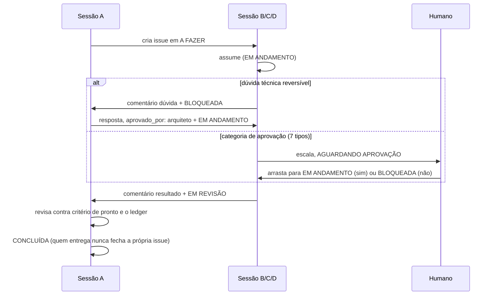

# Mapa do repositório

> Gerado pelo Cartographer. Última varredura: 2026-09-23T03:28:25Z.

Este repositório não é uma aplicação: é o conjunto de ADRs, decisões de processo e
protocolo de coordenação entre sessões do projeto DokDraw. A aplicação de verdade
(`dok-draw-app`, React Flow + TanStack Start + Supabase) fica num repositório irmão e
não está mapeada aqui — nenhuma sessão desta documentação escreve nela.

Escopo desta varredura: 266 dos 375 arquivos rastreáveis (637.507 de 830.517 tokens).
Ficaram de fora, por serem rascunho descartável ou histórico congelado: saída bruta de
teste do spike `adrs/_work/spike-s1/` (Playwright, ~68k tokens de código de teste),
`adrs/_work/prototipos/` (dois HTML estáticos de estudo visual) e `tasks/` (protocolo
antigo, congelado em 2026-09-20). Ver a seção "Fora do escopo" no fim.

## Visão geral: cadeia de dependência dos ADRs

Verde: ADR aceito. Cinza: ADR ainda não escrito. Linha pontilhada: dependência de
ordem/sequência declarada em `insumos/ORDEM.md`, não de contrato técnico direto.

Ordem sugerida a partir de agora (`insumos/ORDEM.md`): **002-E1** (feita) → **013**
Tenancy → **007** → **008** e **009** em paralelo → **010** e **011** em paralelo →
**014** Developer Portal → **012** (fecha, audita todos os outros).

## Por onde começar

1. `insumos/BASE.md` — contexto do produto e arquitetura base inegociável.
2. `adrs/LEDGER.md` — o que está de fato decidido e vinculante hoje, com a seção de
   conflitos em aberto (C-1 a C-7).
3. `adrs/ADR-002-formato-de-conteudo.md` — decisão mais estrutural e menos reversível;
   todas as camadas seguintes dependem dela.
4. `adrs/ADR-003-armazenamento-e-versionamento.md` → `ADR-004-fluxo-editorial.md` →
   `ADR-005-edicao.md` → `ADR-006-shell-da-wiki.md`, na ordem numérica.
5. `insumos/ESTILO-ADR.md` só é necessário para quem vai escrever ou revisar prosa de
   ADR.
6. `guia-sessoes/PROTOCOLO.md` para entender como as sessões A/B/C/D se coordenam.

## Camada de contratos — `adrs/` e `insumos/`

### ADRs aceitos

| ADR | Título | Estado | Depende de | Decisão em uma frase |
| --- | --- | --- | --- | --- |
| 001 | Motor de diagrama | Aceito (só no LEDGER, arquivo não existe em `adrs/`) | — | `@xyflow/react`, nós/edges controlados pelo estado do app, modelo mutável sem histórico em tabelas Supabase |
| 002 | Formato de conteúdo (DokMD v1) | Aceito 2026-09-19 | 001 | CommonMark + GFM + frontmatter + directives de bloco, AST mdast, URIs `dok:` estáveis. ADR menos reversível do conjunto |
| 002-E1 | Emenda 1: execução/desempenho | Aceita 2026-09-20 | 002, 005 | `src/content-format` roda sem DOM/builtins de Node; orçamento 300ms p95 até 5 mil linhas; limite de 300.000 bytes |
| 003 | Armazenamento e versionamento | Aceito 2026-09-19 | 001, 002 | Postgres puro no Supabase, `page_revisions` append-only imutável, `page_drafts` mutável por autor |
| 004 | Fluxo editorial | Aceito 2026-09-19 | 002, 003 | Máquina de estados própria (`revision_status_events`), política de aprovação por espaço, sem papel "publicador" dedicado |
| 005 | Edição | Aceito 2026-09-19 | 001, 002, 003, 004 | MDXEditor 4.2.5 com adaptador via DokAST, modo fonte CodeMirror 6, spike S-1 passou 30/30 |
| 006 | Shell da Wiki (escrita) | Aceito 2026-09-20 | 002-E1, 003, 004, 005 | Rotas sob `_authenticated`, autosave 2s/30s, único ADR sem spike |

### Lacuna declarada

`adrs/ADR-001-*.md` não existe como arquivo: o contrato do motor de diagrama vive só
como bloco YAML dentro de `adrs/LEDGER.md`. Confirmado por listagem direta da pasta.

### `adrs/LEDGER.md`

Fonte de verdade dos contratos vinculantes. Acumula extensões pós-aceite que os
arquivos dos ADRs originais não recebem de volta (o ledger nunca reescreve um ADR já
aceito — states isso explicitamente numa seção própria, linhas 22-45). Traz também:
tabela de numeração oficial (001-015, igual a `insumos/ORDEM.md`), tabela de
conflitos em aberto (C-1 a C-7) e tabela de premissas pendentes por camada futura.

### `adrs/ADR-002-anexos/`

`fixtures/`: as 30 fixtures de referência do Apêndice C do ADR 002, corpus de
regressão compartilhado pelos spikes dos ADRs 002/005/006. `harness/`: implementação
de referência em Node que roda as 30 fixtures e confere idempotência e códigos
`DOK-E`/`DOK-W`.

### `insumos/` (só leitura para todas as sessões)

| Arquivo | Papel |
| --- | --- |
| `BASE.md` | Bloco 0: contexto comum colado antes de todo ADR |
| `ESTILO-ADR.md` | Regras de escrita de prosa de ADR (a régua que `insumos/ESTILO-ADR.md` define e que os ADRs 002-004 e o LEDGER ainda não seguem, por serem anteriores a ela) |
| `ORDEM.md` | Numeração oficial e dependência dos 15 ADRs |
| `supabase-types-dokdraw.ts` | Retrato datado (2026-09-19) do schema real do Supabase, pré-schema `content` |
| `prompts-adrs-original.md` | Plano original de prompts por ADR, com avisos de renumeração histórica |
| `pesquisa-editores-wiki.md` | Rascunho anterior de escolha de editor, insumo do spike do ADR 005 |
| `HANDOFF-ARQUITETURA.md` | Documento de transferência de contexto para a sessão A, retrato datado |
| `KICKOFF.md` | Prompt de abertura histórico, marcado como referência de formato |
| `package.json` | `package.json` real do app, usado nas checagens de compatibilidade dos ADRs |

## Camada de processo — `guia-sessoes/` e `decisoes/`

### O quadro Jira (`guia-sessoes/PROTOCOLO.md`)

Site `dokdrawapp.atlassian.net`, projeto `DDP`, tipo de item `Tarefa`. Colunas, com id
de transição usado pela API:

| Coluna | Transição | Quem escreve / quem lê |
| --- | --- | --- |
| A FAZER | 21 | Escrita por A, espera quem assume |
| EM ANDAMENTO | 31 | Assumida, trabalho rodando |
| BLOQUEADA | 2 | Dúvida aberta, espera A |
| AGUARDANDO APROVAÇÃO | 3 | Escalada ao humano, sem deploy |
| FAZER DEPLOY | 10 | Preview revisado, espera o humano publicar/aplicar migração |
| EM REVISÃO | 4 | Entregue, espera conferência de A |
| CONCLUÍDA | 41 | Revisada e aceita |

Ordem de trabalho de toda sessão (`DEC-0038`): olhar o quadro da direita para a
esquerda e agir na primeira coluna com card seu — EM REVISÃO → FAZER DEPLOY (só A,
nunca tira) → AGUARDANDO APROVAÇÃO → BLOQUEADA → EM ANDAMENTO → A FAZER.

### Ciclo de vida de uma tarefa

Para fatias de desenvolvimento no app existe um segundo trilho paralelo: ordem escrita
por B em `adrs/_work/ordens/` → revisão de ordem por C → aprovação de crédito do
humano → despacho ao Lovable → commit direto na `main` → revisão de resultado por C
(build/typecheck/lint/preview) → card `app-release` em FAZER DEPLOY → humano publica
ou aplica migração e arrasta para CONCLUÍDA. "Refazer" nunca reabre a issue original:
gera issue nova que cita a anterior.

### Quem decide o quê

A decide sozinha toda dúvida técnica, inclusive difícil de reverter
(`aprovado_por: arquiteto`). Só sobem ao humano sete categorias: `ledger`,
`aceite-adr`, `dependencias`, `reabertura`, `fora-de-work`, `commit`, `app-release`. B
e C recusam executar resposta dessas categorias sem `aprovado_por: humano`.

### As quatro sessões (`guia-sessoes/PROMPT-SESSAO-*.md`)

| Sessão | Papel | Roda em | Skills obrigatórias |
| --- | --- | --- | --- |
| A | Arquiteta, PM, scrum master. Cria issues, decide dúvidas técnicas, opera o Lovable, revisa entregas, mantém `ESTADO.md`/`decisoes/` | `dok-draw-documentation` | `brainstorming`, `writing-plans`, `verification-before-completion`, `dispatching-parallel-agents` |
| B | Escreve ADRs, spikes, pesquisa e ordens de implementação. Nunca edita `LEDGER.md`/`decisoes/` direto | `dok-draw-documentation` | `brainstorming`, `systematic-debugging`, `dispatching-parallel-agents`, `verification-before-completion` |
| C | Revisora de arquitetura/UX/UI. Recebe `revisar-ordem` (antes do código) e `revisar-resultado` (depois do commit do Lovable) | `dok-draw-app` | `systematic-debugging`, `verification-before-completion`, `dispatching-parallel-agents`, `design:design-critique`, `design:accessibility-review`, `frontend-design` |
| D | Desenha formas do Diagram Studio no Figma, uma tarefa por forma. Sem conta no Jira, fila pelo rótulo `sessao-d` | Figma (`SquadPro`) | `figma-use`, `figma-generate-library`, `design:design-system`, `design:accessibility-review`, `verification-before-completion` |

Mapa completo de skills e gatilhos, incluindo proibições, em `decisoes/DEC-0001`.

### Regras de posse de pastas

| Pasta/arquivo | Dono | Quem mais escreve |
| --- | --- | --- |
| `insumos/`, `prompts/` | Só o humano | Ninguém |
| `adrs/LEDGER.md`, `adrs/ADR-NNN-*.md` | Sessão A, com aprovação do humano | B só com aprovação `fora-de-work` |
| `adrs/_work/` | Sessão B | Livre para B; A não edita |
| `decisoes/`, `guia-sessoes/`, `ESTADO.md`, `PLANO.md`, `MAPA-DE-FEATURES.md` | Sessão A | B e C só registram achado no comentário de resultado |
| `tasks/` | Ninguém | Só histórico, congelado em 2026-09-20 |
| `dok-draw-app/src/**` | Agente Lovable, via ordem revisada | Nenhuma sessão de IA escreve direto (exceção: `guia-sessoes/bin/instalar-fixtures.sh`) |
| `.env*` de qualquer repositório | Ninguém | Nenhuma sessão lê nem edita |

### `guia-sessoes/bin/` — scripts

| Script | Função |
| --- | --- |
| `aguarda-fila.sh` | Escuta preferida: espera fora da sessão até a fila da sessão pedida ter item no Jira, ou expirar |
| `confere-execucao.sh` | Compara schema aplicado no Postgres com o DDL da ordem versionada |
| `confere-quadro.sh` | Reprova por máquina 9 defeitos de processo já medidos, roda na partida da escuta de A |
| `espera.sh` | Relógio simples do modo de reserva da escuta |
| `instalar-fixtures.sh` | Única escrita de uma sessão da documentação dentro do app: copia as 30 fixtures do ADR 002 |
| `move.sh`, `next-id.sh`, `seen.sh`, `wait-for.sh` | Scripts do protocolo antigo por arquivo (`tasks/`), não usados desde 2026-09-20 |
| `md2wiki.py` | Conversor Markdown → wiki markup do Jira, anterior ao conector do Atlassian |

### `decisoes/` — índice

44 decisões numeradas (`DEC-0001` a `DEC-0044`) mais achados e auditorias pontuais,
indexadas cronologicamente em `decisoes/REGISTRO.md`. Cobrem numeração, sequenciamento
de trilha, regras de processo (`DEC-0038` ordem de trabalho, `DEC-0041` texto de tela
sem referência interna, `DEC-0042` coluna FAZER DEPLOY) e decisões de produto/design
do Diagram Studio (formas, famílias de diagrama, ícones oficiais). `DEC-0043` foi
substituída pela `DEC-0044` no mesmo dia (2026-09-22), com a sucessão registrada
explicitamente nas duas entradas do índice — único caso claro de decisão superada.

### Arquivos da raiz

- `MAPA-DE-FEATURES.md` — retrato do app em 2026-09-22, 15 grupos de feature com
  tabela de estado e sugestões por grupo.
- `ESTADO.md` — painel vivo (trilhas, ADRs, conflitos, sprints). Última atualização
  registrada é 2026-09-20, portanto anterior às decisões DEC-0032 a DEC-0044; o
  próprio arquivo avisa que, ao divergir, vale o ledger ou o código.
- `PLANO.md` — previsão de fim por fatia, medição real de ciclo por fatia entregue.

## Área de trabalho — `adrs/_work/`

### Ordens vivas (`adrs/_work/ordens/`, 40 arquivos)

São as ordens de implementação para o Lovable, cada uma associada a uma issue DDP.
Dois blocos: um por issue individual (fluxo atual do app), outro mais antigo
(`F0`-`F4`, `S1a`-`S2`) das fatias fundacionais dos ADRs 002/003, sem issue única —
cita várias DDPs só como evidência.

| Ordem | Issue | Do que trata | Depende de |
| --- | --- | --- | --- |
| ORDEM-DDP514-icones-aws-bucket.md | DDP-528 | Política RLS de leitura da pasta `aws-icons/` no bucket | — (pré-requisito da DDP-529) |
| ORDEM-DDP514-frame-e-conteineres-aws.md | DDP-529 | Moldura de serviço e seis contêineres AWS | DDP-528 |
| ORDEM-DDP535-desfazer-id-do-no.md | DDP-535 | Corrige desfazer quebrado após restaurar exclusão (RT-C07) | — |
| ORDEM-DDP536-subpasta-id-provisorio.md | DDP-536 | Corrige id provisório de subpasta na árvore (RT-F05) | — |
| ORDEM-DDP512a-setas-alcas-e-ancoras.md | DDP-512 | 16 pontos de conexão por forma, âncora fixa | DDP-453 |
| ORDEM-DDP513-basicas-no-app.md | DDP-513 | Quatro formas básicas (elipse, losango, triângulo, texto) | DDP-515 |
| ORDEM-DDP294-desfazer-refazer.md | DDP-304 | Pilha de comando (undo/redo) | DDP-293 |
| ORDEM-DDP296-colar-imagem.md | DDP-308 | Colar/arrastar imagem, gravada no Supabase Storage | — (`app-release`) |
| ORDEM-DDP395-tela-cabecalho-rodape.md | DDP-399 | Tela de cabeçalho/rodapé com prévia ao vivo | DDP-397 |

Lista completa (40 ordens) no relatório do subagente; padrão do nome do arquivo é
`ORDEM-<issue-ou-fatia>-<slug>.md`, teto de 10.000 bytes por ordem (`DEC-0007`).

### Rascunhos de pesquisa (leitura rasa, ~180k tokens em ~120 arquivos)

Agrupados por prefixo, sem ordem de precedência entre si:

- **`ADR-002-*`**: custo de flags estritas de TS, pendências do diff do ledger da
  Emenda 1, rascunho da própria emenda.
- **`ADR-005-*`**: briefing e fichas de pesquisa por candidata a editor
  (BlockNote, CodeMirror 6, MDXEditor, Milkdown, Plate, Tiptap), consolidação, escopo,
  diff do ledger, lista de pacotes do spike S-1.
- **`ADR-006-escopo.md`**, **`ADR-015-escopo.md`**: escopo aprovado de cada ADR.
- **`ANALISE-*`**: cache no navegador, o que falta no editor frente ao draw.io,
  latência ao soltar elemento.
- **`ESTUDO-*`**: design system dark do site público, fonte dos ícones AWS, todas as
  formas possíveis de seta, vínculo diagrama-wiki no modelo draw.io/Confluence.
- **`FICHA-ADR015-*`**: nó-dentro-de-nó no React Flow, formato de gravação do
  diagrama, licença dos ícones AWS, contrato de validador-plugin.
- **`FICHA-INVENTARIO-*`** e **`INVENTARIO-*`**: inventário de formas/ícones por
  família de diagrama (C4, CI/CD, dados, EIP, ERD, redes/nuvem, tempo, UML, CNCF,
  linguagens/infra), pedido pela DEC-0026/DEC-0027.
- **`PROPOSTA-*`**: cabeçalho/rodapé, janela de propriedades, menu do projeto —
  as três propostas de UI que originaram ordens.
- **`REFERENCIA-drawio-persistencia.md`**: pesquisa de terceiro sobre autosave e
  conexões do draw.io, não verificada contra código-fonte.

**Subpastas com tratamento próprio, fora do escopo profundo desta varredura:**
`spike-s1/` é o spike do ADR 005 (MDXEditor vs. Plate), projeto Vite/Vitest/Playwright
completo, não é aplicação em produção. `prototipos/site-dark/` são dois HTML estáticos
do estudo de design do site público. `aws-icons/` é o acervo de SVGs oficiais AWS por
categoria, mais o manifesto, insumo das ordens DDP-528/DDP-529.

## Fora do escopo desta varredura

| Item | Motivo |
| --- | --- |
| `adrs/_work/spike-s1/mdxeditor/`, `.../plate/`, `.../extra/`, `.../.tanstack/` | Saída bruta de teste (Playwright) e cache de build de um spike já encerrado |
| `adrs/_work/prototipos/` | HTML estático de estudo visual, sem lógica a mapear |
| `tasks/` | Protocolo por arquivo anterior a 2026-09-20, congelado, só leitura histórica |
| `adrs/ADR-002-anexos/fixtures/*/input.md` etc. (conteúdo de cada fixture) | Corpus de teste, já descrito como conjunto em vez de arquivo a arquivo |

Uma atualização futura deste mapa pode aprofundar qualquer um destes itens sob pedido
específico, em vez de reler tudo de novo.

## Lacunas e tensões notadas nesta varredura

- **ADR 001 sem arquivo**: o contrato do motor de diagrama vive só no `LEDGER.md`,
  nunca foi escrito como ADR próprio (`insumos/ORDEM.md` já registra isso como
  pendência).
- **ADR 004 (arquivo) × `LEDGER.md`**: o arquivo descreve a fixação de diagrama por
  revisão como mecanismo pronto mas inerte; o ledger descreve a mesma coisa como
  decisão fechada (`DEC-0019`). O próprio ledger declara esse tipo de divergência como
  esperado, mas quem ler só um dos dois lados pode se confundir.
- **Tenancy sem dono (C-3/C-7 do ledger)**: `content.workspace_members` existe desde o
  ADR 003, mas não há fluxo formal de convite por workspace. Três ADRs aceitos
  dependem do ADR 013, ainda não escrito.
- **`ESTADO.md` desatualizado**: última atualização registrada em 2026-09-20, antes
  das decisões DEC-0032 a DEC-0044 e do `MAPA-DE-FEATURES.md` de 2026-09-22.
- **`decisoes/sprints/`** é citado em `guia-sessoes/PROTOCOLO.md` como destino de
  `SPRINT-NN.md`, mas a pasta não existe hoje: a vida das sprints está registrada
  dentro de `ESTADO.md`.
- **`decisoes/ACHADO-2026-09-20-unique-com-nulo-em-pages.md`** existe no diretório mas
  não aparece indexado em `decisoes/REGISTRO.md`. O conteúdo parece absorvido pela
  `DEC-0014`, mas vale confirmar se foi omissão do índice.

## Navegação por tarefa comum

**Entender uma decisão de arquitetura de camada**: comece pelo ADR aceito da camada em
`adrs/`, depois confira o bloco YAML correspondente em `adrs/LEDGER.md` (pode ter
extensão que o arquivo do ADR não tem).

**Entender uma regra de processo ou de numeração**: `decisoes/REGISTRO.md` é o índice
cronológico; a decisão em si fica em `decisoes/DEC-00NN-*.md`.

**Ver o que já foi implementado no app e o que falta**: `MAPA-DE-FEATURES.md`, na raiz.

**Ver uma ordem de implementação em andamento**: `adrs/_work/ordens/`, filtrando pela
issue DDP no nome do arquivo.

**Entender o protocolo de coordenação entre sessões**: `guia-sessoes/PROTOCOLO.md`
para as regras gerais, `guia-sessoes/PROMPT-SESSAO-<A|B|C|D>.md` para o papel de cada
sessão.
